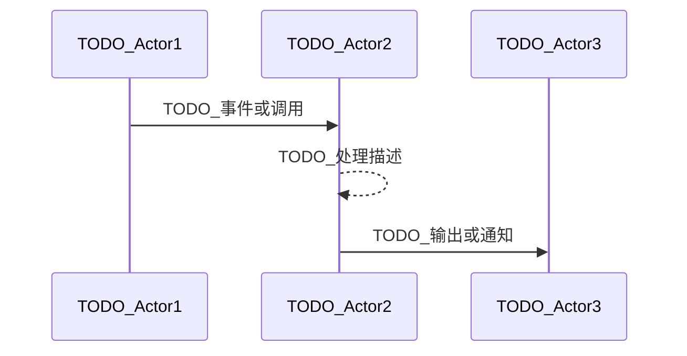

scn_id: SCN_ID_PLACEHOLDER
title: TODO_UPDATE_TITLE
status: Draft
version: v0.1.0
owners:
  - name: TODO_OWNER_NAME
    role: TODO_OWNER_ROLE
    contact: <owner@example.com>
domains: [TODO_DOMAIN_LIST]
layers: [TODO_LAYER_LIST]
repos:
  - key: TODO_REPO_KEY
    scope: TODO_SCOPE
    responsibility: TODO_RESPONSIBILITY
related_usecases:
  - doc_id: TODO_DOC_ID
    layer: TODO_LAYER
    domain: TODO_DOMAIN
last_reviewed_at: YYYY-MM-DD

---

# Executive Summary

> 提示：请删除本提示，并将下方所有 `TODO_*` 占位符替换为实际内容。
说明业务背景、主要目标、关键角色以及成功判定标准。

# Scope & Guardrails

- **In Scope**：TODO_列出纳入范围（仓库、模块、版本假设）。
- **Out of Scope**：TODO_列出不覆盖的流程或边界。
- **Environment & Flags**：TODO_前置条件、所需 Feature Flag、外部依赖。

# Participants & Responsibilities

| Scope | Repository | Layer | 责任与交付物 | Owners |
|-------|------------|-------|--------------|--------|
| TODO_SCOPE | TODO_REPO | TODO_LAYER | TODO_责任与交付物 | TODO_OWNER |

# End-to-End Flow

1. **Stage 1 – TODO_STAGE_NAME**：描述触发者、输入与关键事件。
2. **Stage 2 – TODO_STAGE_NAME**：列出流程、API 调用、状态变化。
3. **Stage 3 – TODO_STAGE_NAME**：说明系统处理、存储或同步动作。
4. **Stage 4 – TODO_STAGE_NAME**：描述最终结果、用户反馈与后续步骤。

# Key Interactions & Contracts

- **APIs / Events**：TODO_列出接口或事件、方法、路径、载荷示例。
- **Configs / Schemas**：TODO_引用标准文档或 schema。
- **Security / Compliance**：TODO_权限、审计、合规要点。

# Usecase Links

- `TODO_DOC_ID` — TODO_说明（TODO_LAYER 层，自有仓路径）

# Acceptance Criteria

1. TODO_业务指标（可量化，例如时间/成功率）。
2. TODO_治理或风控约束。
3. TODO_协作或验证要求。

# Telemetry & Ops

- 指标：TODO_指标名称。
- 告警阈值：TODO_触发条件与通知渠道。
- 观测来源：TODO_仪表板或脚本。

# Open Issues & Follow-ups

| 风险/事项 | 影响范围 | 负责人 | ETA |
|-----------|----------|--------|-----|
| TODO_风险或跟进项 | TODO_影响范围 | TODO_负责人 | YYYY-MM-DD |

# Appendix

- TODO_相关 PR 或任务链接。
- TODO_设计稿 / 白板 / 外部文档。
- TODO_历史版本或里程碑记录。
