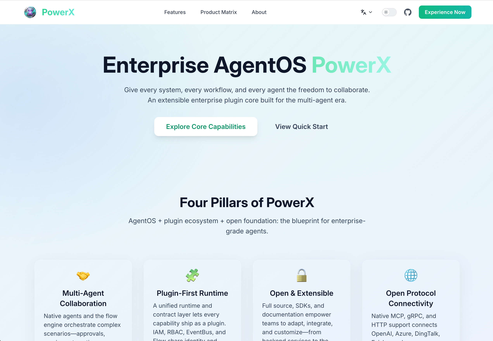

# PowerXDocs

 

  <a href="README.zh-CN.md">🇨🇳 中文</a> |
  <a href="README.md">🇺🇸 English</a>

 

## What is PowerX?

**PowerX** is an enterprise-grade **Agent Operating System** that enables organizations to build, deploy, and manage AI agents at scale. Think of it as the infrastructure layer that makes AI agents production-ready, observable, and governable.

### Core Capabilities

**Multi-Agent Orchestration**
- Deploy and coordinate thousands of AI agents across your infrastructure
- Handle complex workflows that span multiple agents and external systems
- Automatic load balancing, scaling, and failover for agent instances

**Enterprise Integrations**
- Connect to your existing systems: databases, APIs, message queues, cloud services
- Secure authentication and authorization with enterprise identity providers
- Data governance and compliance controls built-in

**Observability & Control**
- Real-time monitoring of agent performance, resource usage, and behavior
- Centralized logging, tracing, and metrics across all agent operations
- Built-in alerting and automated remediation for common issues

**Runtime Management**
- Dynamic agent lifecycle management (deploy, scale, restart, retire)
- Version control and rollback for agent configurations
- A/B testing and canary deployments for agent updates

### Architecture Overview

PowerX follows a **plugin-based architecture** where agents run as isolated plugins within the PowerX runtime:

- **Plugin Runtime**: Secure sandboxed execution environment for each agent
- **Orchestration Layer**: Handles agent scheduling, communication, and coordination
- **Service Mesh**: Provides secure, reliable communication between agents and external services
- **Control Plane**: Manages configuration, monitoring, and governance across the entire system

### Why PowerX?

- **Production-Ready**: Built for enterprise scale with high availability, security, and compliance
- **Vendor Neutral**: Works with any AI model provider (OpenAI, Anthropic, local models, etc.)
- **Developer Friendly**: SDKs in multiple languages with extensive documentation
- **Future-Proof**: Designed to evolve with rapidly advancing AI capabilities

## What is PowerXDocs?

PowerXDocs is the **central documentation hub** for the PowerX ecosystem. It provides comprehensive resources to help you succeed with PowerX:

- **Scenarios & Use Cases**: Real-world implementation patterns from various industries
- **Product Guides**: Detailed explanations of features, architecture, and best practices
- **Developer Resources**: SDK documentation, API references, and integration guides
- **Operations Playbooks**: Monitoring, troubleshooting, and maintenance procedures

## Documentation Structure

- **Getting Started**: Installation, setup, and your first agent
- **Core Concepts**: Understanding agents, plugins, and orchestration
- **Use Cases**: Industry-specific examples and solution patterns
- **Developer Guides**: Building, deploying, and managing agents
- **Operations**: Monitoring, troubleshooting, and optimization
- **Reference**: Complete API documentation and configuration reference

## Who Uses PowerX?

- **Startup Founders & SMB Owners** rapidly building AI-powered products without large engineering teams
- **Software Engineers** building AI-powered applications and services
- **Platform Engineers** creating enterprise AI infrastructure
- **Solutions Architects** designing scalable AI systems
- **DevOps Teams** managing AI agent operations and monitoring
- **Product Managers** defining AI-powered product features