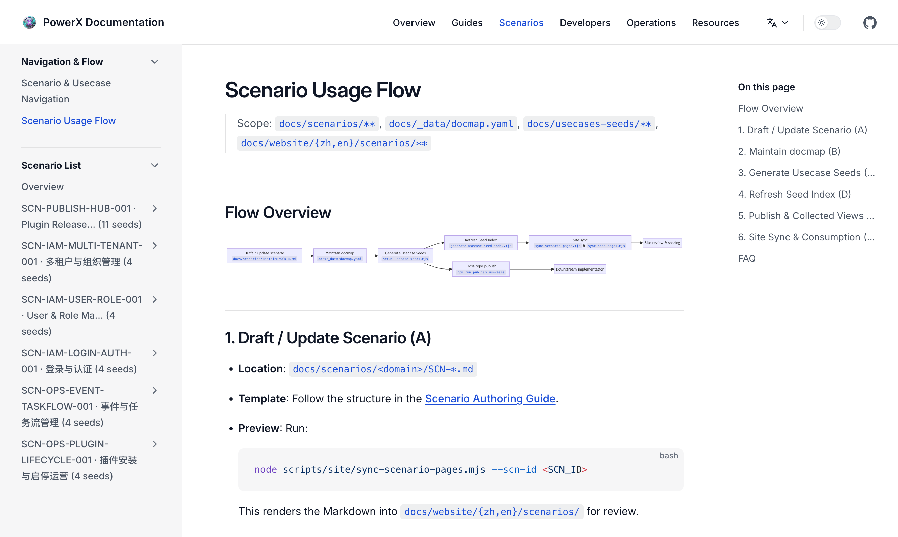

# PowerXDocs

 

  <a href="README.zh-CN.md">🇨🇳 中文</a> |
  <a href="README.md">🇺🇸 English</a>

 

## Project Overview

PowerXDocs serves as the documentation hub for the PowerX ecosystem, centrally managing cross-repository scenarios (SCN), use case templates, universal standards, and leadership summary views. Built on VitePress 1.6 and TailwindCSS for static site generation, it provides a suite of Node.js 18 CLI workflows that synchronize master content to downstream repositories like PowerX, PowerXPlugin, and PowerXMarketplace through a pure Push mechanism.

## Key Features

- **Unified Information Source**: All scenarios, standards, and templates are maintained in `docs/**`, with rendered output generated to `docs/website/**`, eliminating the need for manual downstream repository changes.
- **Automated Publishing Workflows**: `scripts/publish/*.mjs` provides cross-repository synchronization, report generation, and distribution auditing, ensuring consistent versioned specifications.
- **Multi-language & Localization**: `scripts/localization/*.mjs` validates and synchronizes multi-language content, supporting Chinese, English, and other language-specific sites.
- **Governance & Telemetry**: Workflow status is written to `reports/_state/**` and can be summarized into visual metrics through QA scripts.

## Directory Overview

- `docs/`: Documentation source files (scenarios, standards, use case masters, website output, etc.)
- `scripts/`: Automation scripts (localization, publishing, QA, site building, scenario scripts)
- `reports/`: Workflow execution reports and distribution audit results
- `specs/`: Feature specifications, implementation plans, and requirements lists
- `tests/`: Node.js 18 `node --test` based workflow-level tests

## Environment Requirements

- Node.js ≥18
- npm (or pnpm/yarn) for dependency installation
- Git access permissions (including downstream repositories for executing distribution scripts)

## Quick Start

1. Install dependencies: `npm install`
2. Start local documentation site: `npm run docs:dev`
3. Build production site: `npm run docs:build`
4. Run ESLint checks: `npm run lint`
5. Execute workflow tests: `npm run test:workflows`

## Key Workflows & Scripts

- `npm run publish:scenarios -- --scn-id <id>`: Render and sync specified scenarios from `docs/scenarios/` to downstream repository `_from_hub/` areas
- `npm run publish:usecases -- --scn-id <id>`: Distribute Use Case templates, maintaining alignment with `docmap.yaml` for hierarchy, domain, and version consistency
- `npm run publish:standards`: Sync `docs/standards/**` as read-only specifications with distribution auditing
- `npm run publish:collected`: Generate `_collected` summary pages for leadership-level coverage overview
- `npm run publish:notify`: Send reminders for unmerged downstream PRs, ensuring review closure
- `node scripts/localization/sync-locales.mjs` / `check-parity.mjs`: Maintain multi-language content consistency
- `node scripts/qa/workflow-metrics.mjs`: Aggregate workflow telemetry data and output governance reports

## Data & Governance Constraints

- `docs/_data/docmap.yaml`: Registry for all scenario and use case metadata (scope/layer/domain, repo, path, optionality), must pass validation before publishing
- `docs/_data/repos.yaml`: Declaration of all downstream repository sync paths and branch configurations
- `_collected` generation logic requires valid layer and domain combinations, exceptions will be blocked in workflows and reported
- Publishing scripts record successful files, failed items, and retry hints in `reports/**`, recommended to check before PR submission

## Collaboration Guidelines

- For new scenarios, please first copy `docs/standards/scenarios/_template.md`, then register in `docmap.yaml`
- After modifying use case templates or standards, be sure to run the corresponding publishing scripts to ensure downstream repositories receive updates
- When extending scripts, maintain TypeScript/Node 18 compatibility and add corresponding tests in `tests/workflows/`

## Reference Documentation

- `docs/guides/`: Manuals and publishing guidelines
- `docs/standards/`: Cross-repository governance standards and templates
- `specs/**`: Feature specifications, implementation plans, and acceptance criteria

PowerXDocs serves as the single entry point for PowerX documentation management, helping documentation operations, product, and technical teams collaborate within a unified framework to ensure cross-repository content consistency, traceable processes, and evidence-based governance.
