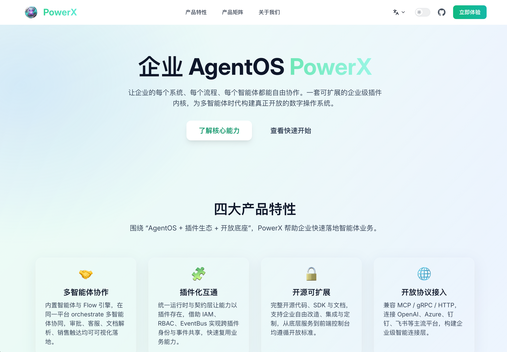
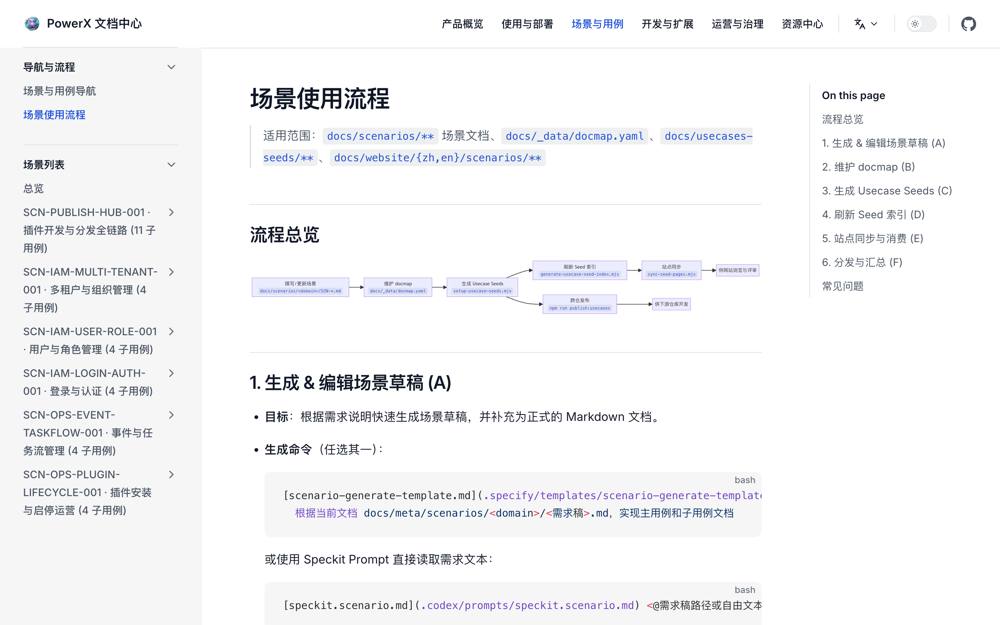

# PowerXDocs

 

  <a href="README.zh-CN.md">🇨🇳 中文</a> |
  <a href="README.md">🇺🇸 English</a>

 

## 项目简介

PowerXDocs 是 PowerX 生态的文档中枢仓库，负责集中管理跨仓场景（SCN）、用例模板、通用标准与领导层汇总视图。仓库基于 VitePress 1.6 与 TailwindCSS 构建静态站点，同时提供一系列 Node.js 18 CLI 工作流，将母版内容以纯 Push 方式同步到 PowerX、PowerXPlugin、PowerXMarketplace 等下游仓库。

## 核心特性

- **统一信息源**：所有场景、标准和模板均在 `docs/**` 维护，渲染产物输出到 `docs/website/**`，避免下游仓手动改动。
- **自动化发布工作流**：`scripts/publish/*.mjs` 提供跨仓同步、报告输出与分发审计，确保规范版本一致。
- **多语言与本地化**：`scripts/localization/*.mjs` 校验并同步多语言内容，支撑中英等多语站点。
- **治理与遥测**：工作流生成的状态写入 `reports/_state/**`，并可通过 QA 脚本汇总可视化指标。

## 目录概览

- `docs/`：文档源文件（场景、标准、用例母版、网站产出等）。
- `scripts/`：自动化脚本（本地化、发布、QA、站点构建、场景脚本）。
- `reports/`：工作流执行报告与分发审计结果。
- `specs/`：功能方案、实施计划与需求清单。
- `tests/`：Node 18 `node --test` 的工作流级别测试。

## 环境要求

- Node.js ≥18
- npm（或 pnpm/yarn）用于安装依赖
- Git 访问权限（含下游仓库，以便执行分发脚本）

## 快速开始

1. 安装依赖：`npm install`
2. 启动本地文档站点：`npm run docs:dev`
3. 构建生产站点：`npm run docs:build`
4. 运行 ESLint 校验：`npm run lint`
5. 执行工作流测试：`npm run test:workflows`

## 关键工作流与脚本

- `npm run publish:scenarios -- --scn-id <id>`：将指定场景从 `docs/scenarios/` 渲染并同步到下游仓的 `_from_hub/` 区域。
- `npm run publish:usecases -- --scn-id <id>`：分发 Usecase 模板，保持层级、领域、版本与 `docmap.yaml` 对齐。
- `npm run publish:standards`：同步 `docs/standards/**` 为只读规范，落地分发审计。
- `npm run publish:collected`：生成 `_collected` 汇总页供领导层查看覆盖范围。
- `npm run publish:notify`：针对未合并的下游 PR 发送提醒，确保审阅闭环。
- `node scripts/localization/sync-locales.mjs` / `check-parity.mjs`：维护多语言内容一致性。
- `node scripts/qa/workflow-metrics.mjs`：聚合工作流遥测数据，输出治理报告。

## 数据与治理约束

- `docs/_data/docmap.yaml`：登记所有场景、用例的元数据（scope/layer/domain、repo、路径、可选性），发布前必须校验通过。
- `docs/_data/repos.yaml`：声明所有下游仓库的同步路径与分支设置。
- `_collected` 生成逻辑要求合法的层级与领域组合，异常会在工作流中阻断并输出报告。
- 发布脚本会在 `reports/**` 记录成功文件、失败项与重试提示，建议在提交 PR 前检查。

## 协作建议

- 新增场景请先复制 `docs/standards/scenarios/_template.md`，再登记到 `docmap.yaml`。
- 修改用例模板或标准后务必运行对应发布脚本，确保下游仓收到更新。
- 若需扩展脚本，请保持 TypeScript/Node 18 兼容，并在 `tests/workflows/` 添加对应测试。

## 参考文档

- `docs/guides/`：操作手册与发布指引。
- `docs/standards/`：跨仓治理标准与模板。
- `specs/**`：功能规格、实施计划与验收标准。

PowerXDocs 作为 PowerX 文档管控的唯一入口，帮助文档运营、产品和技术团队在统一框架下协作，保障跨仓内容一致、流程可追溯、治理有据可依。
