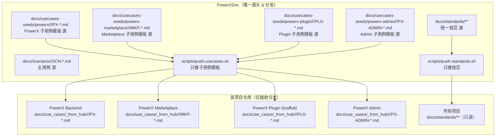
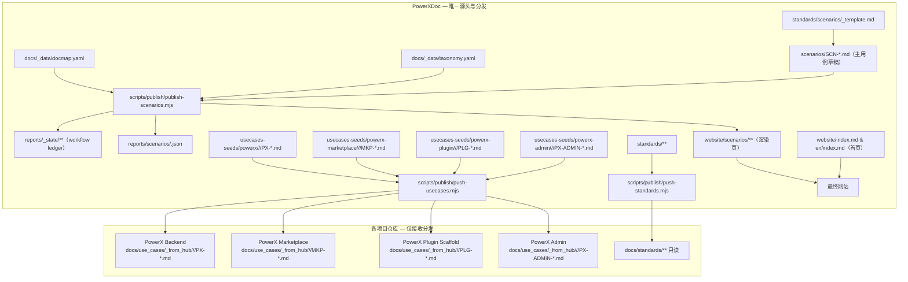
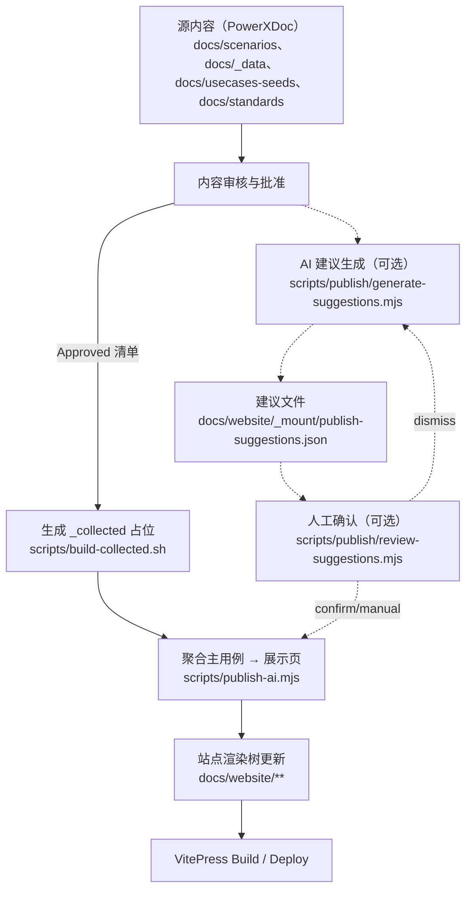

最新文档体系（PowerXDoc 已采用 `docs/website` 渲染结构）的**最终整合版设计文档**。

可以直接保存为：
`PowerXDoc/docs/design/cross-repo-documentation.md`

---


# PowerX 多仓用例文档统一与聚合方案（多层用例版）

*(跨仓 SCN 主用例 + 各侧子用例聚合渲染方案 / 纯 Push / 按层级与领域组织)*

---

## 1. 设计目标

在 PowerX 体系中，存在多个独立代码仓：

* **PowerX (PowerX Backend)**
* **PowerXAdmin (PowerX Web Admin)**
* **PowerXPlugin (PowerX Plugin Scaffold)**
* **PowerXMarketplace (PowerX Marketplace)**

每个仓有各自的文档与上下文；而端到端场景（SCN）往往跨仓、跨层（后端/前端/插件/市场），并按**领域（Domain）**细分。
本方案确保：

> 各仓继续独立产文（AI 可在本仓上下文中生成），
> **PowerXDoc** 作为唯一聚合中心 —— 统一**索引 / 对齐 / 渲染 / 发布**，
> 并引入**多层（Layer）+ 领域（Domain）**的目录规范。

---

## 2. 整体架构一览（纯 Push）



> **说明**：纯 Push 架构，无任何 pull；各仓 `_from_hub` 仅接收模板，作者在各自仓的 `docs/use_cases/<layer>/<domain>/` 产出“自有用例”。

---

## 3. 各仓文档规范（子用例 · 多层/领域）

**存放位置（作者自有用例）**：
`docs/use_cases/<layer>/<domain>/<PREFIX>-<SCN_KEY>-<NNN>.md`

**层（layer）推荐枚举**（可扩展）：

* `domain`（领域业务规则/领域服务）
* `api`（对外 API / 控制器）
* `service`（应用服务/编排）
* `repo`（仓储/数据访问）
* `ui`（前端页面/交互）
* `ops`（运维/可观测/配置）
* `proto`（契约/Schema/Manifest）

> 仅为目录组织参考，不限制文档内容跨层引用。

**领域（domain）示例**：`publish`、`install`、`license`、`catalog`、`billing`、`account` 等。

**命名前缀**（统一约定）：

* **PX**（PowerX / Backend）：`PX-*`
* **MKP**（Marketplace）：`MKP-*`
* **PLG**（Plugin）：`PLG-*`
* **PX-ADMIN**（Admin）：`PX-ADMIN-*`

**示例**（PowerX Backend · 发布域 · 服务层）：

```
docs/use_cases/service/publish/PX-PUBLISH-002.md
```

**统一元信息头**（所有仓/层通用）：

```markdown
---
doc_id: PX-PUBLISH-002             # 子用例唯一ID（前缀按仓）
scn_id: SCN-PUBLISH-002            # 关联主用例ID
title: PX 侧 - 发布后目录同步与缓存（service 层）
repo: powerx-backend               # 仓库标识（与 repos.yaml 对应键）
layer: service                     # 层（layer）
domain: publish                    # 领域（domain）
version: v1.12.0
status: Approved
---

# PX 侧（service 层）：插件发布后同步可安装目录

...（正文：交互/流程/契约/状态/UAT 等；保持 AI 可读）
```

> **模板接收路径**（只读）：
> 各仓 `docs/use_cases/_from_hub/<layer>/<domain>/<PREFIX>-*.md` 仅存放 **中心下发模板**。

---

## 4. PowerXDoc 仓目录结构（聚合与渲染规范 · 多层/领域）

> **说明**
>
> * **仅** `docs/website/**` 参与 VitePress 渲染；其他目录仅供 AI/脚本使用。
> * PowerXDoc 是中枢：分发模板/规范 → 维护主用例源 → 聚合生成展示页。
> * `_collected` 为聚合缓存（本地生成），**不**从各仓拉取内容。

```
PowerXDoc/
├─ docs/
│  ├─ design/                          # 设计体系文档（手写，不渲染）
│  │  └─ cross-repo-documentation.md
│  │
│  ├─ website/                         # 渲染站点（srcDir）
│  │  ├─ index.md
│  │  ├─ en/index.md
│  │  ├─ scenarios/                    # ✅ 主用例展示区（最终渲染）
│  │  │  ├─ SCN-PUBLISH-002.md
│  │  │  └─ SCN-INSTALL-003.md
│  │  ├─ _collected/                   # ❌ 子用例聚合缓存（不渲染）
│  │  │  ├─ px/        # PX（按层/域）
│  │  │  │  └─ service/publish/PX-PUBLISH-002.md
│  │  │  ├─ mkp/
│  │  │  │  └─ api/publish/MKP-PUBLISH-002.md
│  │  │  ├─ plg/
│  │  │  │  └─ proto/publish/PLG-PUBLISH-002.md
│  │  │  └─ admin/
│  │  │     └─ ui/publish/PX-ADMIN-PUBLISH-002.md
│  │  ├─ pages/                        # 说明/索引页（AI 生成）
│  │  ├─ public/                       # 静态资源
│  │  └─ _mount/                       # AI 中间态（不渲染）
│  │
│  ├─ _data/                           # 元数据（AI/脚本使用）
│  │  ├─ repos.yaml                    # 各仓配置（已按“develop”示例）
│  │  └─ docmap.yaml                   # 主用例 → 子用例映射（含层/域）
│  │
│  ├─ standards/                       # 统一规范源（推送到各仓，不渲染）
│  ├─ scenarios/                       # 主用例草稿（不渲染）
│  ├─ usecases-seeds/                  # 子用例模板（不渲染）
│  │  ├─ powerx/<layer>/<domain>/PX-*.md
│  │  ├─ powerx-marketplace/<layer>/<domain>/MKP-*.md
│  │  ├─ powerx-plugin/<layer>/<domain>/PLG-*.md
│  │  └─ powerx-admin/<layer>/<domain>/PX-ADMIN-*.md
│  └─ analysis/                        # 聚合结果/索引（不渲染）
│
└─ scripts/
   ├─ push-usecases.sh                 # 分发子用例模板（含层/域）
   ├─ push-standards.sh                # 分发统一规范
   └─ publish-ai.mjs                   # 聚合主用例 → 生成 website/scenarios/**
```

---

### 🧠 关键目录逻辑：分发 → 聚合 → 渲染（纯 Push）



---

### 📘 各目录职责与生成方式

| 目录                    | 作用                            | 渲染 | 生成      |
| --------------------- | ----------------------------- | -- | ------- |
| `design/`             | 体系设计文档（内部参考）                  | ❌  | 手写      |
| `website/`            | **唯一渲染目录**（首页/主用例/说明）         | ✅  | 手写 + AI |
| `website/_collected/` | 子用例聚合缓存（按 scope/layer/domain） | ❌  | AI      |
| `_data/`              | 仓配置/映射（AI/脚本读取）               | ❌  | 手写      |
| `standards/`          | 统一规范（推送至各仓）                   | ❌  | 手写      |
| `scenarios/`          | 主用例草稿源                        | ❌  | AI/手写   |
| `usecases-seeds/`     | 子用例模板（按层/域）                   | ❌  | AI      |
| `analysis/`           | 聚合索引/统计                       | ❌  | AI      |
| `scripts/`            | 分发与聚合脚本                       | ❌  | 手写      |

---

## 5. `_data` 文件定义（多层/领域版）

### `docs/_data/repos.yaml`（示例）

（你前面那份已校验通过，这里不重复；保持 `receive_paths.usecases_from_hub: docs/use_cases/_from_hub` 即可）

### `docs/_data/docmap.yaml`（支持层/域）

```yaml
schema_version: 2
# 外链：{repos[repo].web_base}/blob/{branch or repos[repo].default_branch}/{path}

scenarios:
  SCN-PUBLISH-002:
    title: 插件发布（上架）
    summary: 覆盖插件构建、元数据校验、签名、审核、上架与目录同步
    weight: 10
    tags: [publish, marketplace, plugin]
    children_order: [plg, mkp, px, admin]
    children:
      px:
        repo: powerx-backend
        layer: service
        domain: publish
        path: docs/use_cases/service/publish/PX-PUBLISH-002.md
        title: PX（service）：目录同步与缓存更新
      mkp:
        repo: powerx-marketplace
        layer: api
        domain: publish
        path: docs/use_cases/api/publish/MKP-PUBLISH-002.md
        title: MKP（api）：审核与上架流程
      plg:
        repo: powerx-plugin-scaffold
        layer: proto
        domain: publish
        path: docs/use_cases/proto/publish/PLG-PUBLISH-002.md
        title: PLG（proto）：构建、签名与提交
      admin:
        repo: powerx-admin
        layer: ui
        domain: publish
        path: docs/use_cases/ui/publish/PX-ADMIN-PUBLISH-002.md
        title: PX-ADMIN（ui）：上架后管理与交互
        optional: true

  SCN-INSTALL-003:
    title: 插件安装与授权
    summary: 从市场安装到 PX 鉴权、授权绑定与启用的端到端流程
    weight: 20
    tags: [install, license]
    children_order: [mkp, px, plg, admin]
    children:
      px:
        repo: powerx-backend
        layer: service
        domain: install
        path: docs/use_cases/service/install/PX-INSTALL-003.md
        title: PX（service）：安装、鉴权与授权下发
      mkp:
        repo: powerx-marketplace
        layer: api
        domain: install
        path: docs/use_cases/api/install/MKP-INSTALL-003.md
        title: MKP（api）：购买与安装指引
      plg:
        repo: powerx-plugin-scaffold
        layer: proto
        domain: install
        path: docs/use_cases/proto/install/PLG-INSTALL-003.md
        title: PLG（proto）：安装后自检与引导
      admin:
        repo: powerx-admin
        layer: ui
        domain: install
        path: docs/use_cases/ui/install/PX-ADMIN-INSTALL-003.md
        title: PX-ADMIN（ui）：安装引导与开通状态
        optional: true
```

> **要点**
>
> * `children.*` 增加 `layer` / `domain` 字段，仅用于展示/索引（不拉取）。
> * `path` 指向“各仓**自有用例**”位置（不是 `_from_hub`）。
> * 站点根据 `repo + branch + path` 生成只读外链和子卡片信息；无任何 pull。

---

## 6. 主用例模板（PowerXDoc 专用 · 多层/领域友好）

> 位置：`docs/website/scenarios/SCN-PUBLISH-002.md`

```markdown
# SCN-PUBLISH-002 插件发布（上架）端到端场景

## 业务目标
开发者通过 `px-plugin publish` 提交 `.pxp` 包；  
Marketplace 完成签名校验与审核；  
PX 端（PowerX）更新“可安装目录”缓存；  
PX-ADMIN 展示上架状态与管理入口。

---

## 场景流程（跨仓/跨层）
1. **PLG / proto**：生成签名包，校验 manifest，`px-plugin publish` 提交。
2. **MKP / api**：校验签名 & manifest → 审核 → 触发 `mkp.plugin.published`。
3. **PX / service**：监听事件 → 拉取/合并插件元数据 → 刷新缓存。
4. **PX-ADMIN / ui**：展示“已上架插件”，支持筛选、详情与配置操作。

---

## 子用例（Usecase Links · 分层/领域）
| 模块/层/域 | 用例文档 | 简介 |
|---|---|---|
| PX / service / publish | [[PX-PUBLISH-002]](/_collected/px/service/publish/PX-PUBLISH-002.md) | 目录同步与缓存更新 |
| MKP / api / publish | [[MKP-PUBLISH-002]](/_collected/mkp/api/publish/MKP-PUBLISH-002.md) | 审核与上架流程 |
| PLG / proto / publish | [[PLG-PUBLISH-002]](/_collected/plg/proto/publish/PLG-PUBLISH-002.md) | 构建、签名与提交 |
| PX-ADMIN / ui / publish | [[PX-ADMIN-PUBLISH-002]](/_collected/admin/ui/publish/PX-ADMIN-PUBLISH-002.md) | 上架后管理与交互界面 |

> 注：以上链接为聚合缓存，不做内容拉取；页面会同时生成各仓“自有用例”的 GitHub 外链。

---

## 契约引用（Contract References）
- **API**
  - `POST /api/v1/plugins/publish`（PLG → MKP）
  - `GET /api/v1/plugins/catalog`（PX 拉取可安装目录）
- **Event**
  - `mkp.plugin.published`（MKP 审核通过并上架）
  - `px.plugins.cache.refresh`（PX 刷新缓存）
- **CLI**
  - `px-plugin publish`
- **Manifest**
  - `plugin.yaml`（元信息/签名/权限声明等）

---

## 验收标准（Acceptance Criteria）
- 完整闭环：PLG → MKP → PX → PX-ADMIN。
- 发布后 5 分钟内 PX 可拉取到新插件。
- MKP 审核状态与 PX-ADMIN 同步。
- 全链路具备日志与审计记录。

---

## 元信息（Metadata）
| 字段 | 值 |
|---|---|
| SCN ID | SCN-PUBLISH-002 |
| 关联子用例 | PX(service/publish), MKP(api/publish), PLG(proto/publish), PX-ADMIN(ui/publish) |
| 状态 | Approved |
| 版本 | v1.12.0 |
| 维护方 | PowerX Core Team |
```

---

## 7. 脚本与构建（纯 Push，无网络拉取）

### A) `scripts/build-collected.sh`

> 功能：**不拉取对方仓内容**；按 `docmap.yaml` 生成 `_collected/` 下的**占位 MD**，写入外链与元信息（支持多层/领域与 px/mkp/plg/admin 四侧）。

```bash
#!/usr/bin/env bash
set -euo pipefail

ROOT="$(cd "$(dirname "$0")/.."; pwd)"
DATA="$ROOT/docs/_data"
COL="$ROOT/docs/website/_collected"

mkdir -p "$COL"

# 读取 repos 配置（用于拼接外链）
repos_json="$(yq -o=json '.repos' "$DATA/repos.yaml")"

# 安全取仓字段
get_repo_field() {
  local repo="$1" field="$2"
  echo "$repos_json" | jq -r --arg r "$repo" --arg f "$field" '.[$r][$f]'
}

# 生成单个占位 md（不会拉取远端 md）
emit_stub() {
  local scope="$1" repo="$2" layer="$3" domain="$4" path="$5" scn="$6" title="$7" opt="${8:-false}"

  local web_base branch
  web_base="$(get_repo_field "$repo" "web_base")"
  branch="$(get_repo_field "$repo" "default_branch")"
  # 允许 docmap 覆盖分支：如果 children 节点有 branch，则在调用方传第9参
  local override_branch="${9:-}"
  if [[ -n "${override_branch}" && "${override_branch}" != "null" ]]; then
    branch="$override_branch"
  fi

  # 文件名和 ID（从 path basename 提取）
  local fname="$(basename "$path")"              # e.g. PX-PUBLISH-002.md
  local doc_id="${fname%.md}"

  # 目标路径（按 scope/layer/domain 多层目录）
  local out_dir="$COL/$scope/$layer/$domain"
  local out_md="$out_dir/$fname"
  mkdir -p "$out_dir"

  local external_url="${web_base}/blob/${branch}/${path}"

  cat > "$out_md" <<EOF
---
doc_id: ${doc_id}
scn_id: ${scn}
title: ${title}
repo: ${repo}
scope: ${scope}
layer: ${layer}
domain: ${domain}
external_url: ${external_url}
optional: ${opt}
source: stub
---

# ${doc_id}

> 这是聚合占位文件（不拉取对方仓内容）。  
> **查看完整用例：** ${external_url}

- 归属：\`${scope}\` / \`${layer}\` / \`${domain}\`
- 关联 SCN：\`${scn}\`
- 仓库：\`${repo}\`
EOF

  echo "✓ stub -> $out_md"
}

# 遍历 docmap 生成占位
for scn in $(yq -r '.scenarios | keys[]' "$DATA/docmap.yaml"); do
  # children 节点键是 px/mkp/plg/admin
  for side in px mkp plg admin; do
    if yq -e ".scenarios.$scn.children.$side" "$DATA/docmap.yaml" >/dev/null 2>&1; then
      repo=$(yq -r ".scenarios.$scn.children.$side.repo" "$DATA/docmap.yaml")
      layer=$(yq -r ".scenarios.$scn.children.$side.layer" "$DATA/docmap.yaml")
      domain=$(yq -r ".scenarios.$scn.children.$side.domain" "$DATA/docmap.yaml")
      path=$(yq -r ".scenarios.$scn.children.$side.path" "$DATA/docmap.yaml")
      title=$(yq -r ".scenarios.$scn.children.$side.title" "$DATA/docmap.yaml")
      optional=$(yq -r ".scenarios.$scn.children.$side.optional // false" "$DATA/docmap.yaml")
      branch=$(yq -r ".scenarios.$scn.children.$side.branch // \"\"" "$DATA/docmap.yaml")

      # side 到 scope 目录名一致：px/mkp/plg/admin
      emit_stub "$side" "$repo" "$layer" "$domain" "$path" "$scn" "$title" "$optional" "$branch"
    fi
  done
done
```

**运行：**

```bash
bash scripts/build-collected.sh
```

**结果：**
`docs/website/_collected/<scope>/<layer>/<domain>/<ID>.md`
（每个文件只是一张“卡片”占位，带外链），**不**访问网络。

---

### B) `scripts/push-usecases.sh`

> 功能：把 **模板** 从 `docs/usecases-seeds/<repo-scope>/<layer>/<domain>/` 分发到各仓的 `_from_hub/<layer>/<domain>/`。只 push，不 pull。

```bash
#!/usr/bin/env bash
set -euo pipefail

ROOT="$(cd "$(dirname "$0")/.."; pwd)"
DATA="$ROOT/docs/_data"
SEEDS="$ROOT/docs/usecases-seeds"

repos_json="$(yq -o=json '.repos' "$DATA/repos.yaml")"

get_repo_field() {
  local repo="$1" field="$2"
  echo "$repos_json" | jq -r --arg r "$repo" --arg f "$field" '.[$r][$f]'
}

# scope 与 seeds 子目录映射
scope_dir() {
  case "$1" in
    px) echo "powerx" ;;
    mkp) echo "powerx-marketplace" ;;
    plg) echo "powerx-plugin" ;;
    admin) echo "powerx-admin" ;;
    *) echo "unknown"; return 1 ;;
  esac
}

push_one_repo() {
  local repo="$1"
  local url push_branch dst_root
  url="$(get_repo_field "$repo" "url")"
  push_branch="$(get_repo_field "$repo" "push_branch")"
  dst_root="$(get_repo_field "$repo" "receive_paths" | jq -r '.usecases_from_hub')"

  if [[ -z "$dst_root" || "$dst_root" == "null" ]]; then
    echo "[skip] $repo: no receive_paths.usecases_from_hub"
    return 0
  fi

  local tmp="$ROOT/.out/$repo"
  rm -rf "$tmp" && mkdir -p "$tmp"
  git clone --depth=1 -b "$push_branch" "$url" "$tmp" >/dev/null 2>&1 || {
    # 分支可能不存在，退回默认分支再创建
    git clone --depth=1 "$url" "$tmp"
    (cd "$tmp" && git checkout -b "$push_branch")
  }

  # 将所有 seeds 结构（按 scope/layer/domain）复制过去
  rsync -a --mkpath "$SEEDS/" "$tmp/$dst_root/"

  (cd "$tmp"
    if [ -n "$(git status --porcelain)" ]; then
      git add .
      git commit -m "chore(doc): sync usecase seeds from PowerXDoc"
      git push origin "$push_branch"
      echo "✓ pushed -> $repo:$dst_root ($push_branch)"
    else
      echo "✓ no changes -> $repo"
    fi
  )
}

# 按 repos.yaml 全量分发
for repo in $(yq -r '.repos | keys[]' "$DATA/repos.yaml"); do
  push_one_repo "$repo"
done
```

> 说明：
>
> * 该脚本**直接复制完整的模板目录树**（含 layer/domain）。
> * 各仓落点：`docs/use_cases/_from_hub/<layer>/<domain>/…`。
> * 只推送，不拉取。

---

### C) `scripts/push-standards.sh`

> 功能：把 `docs/standards/**` 下发到各仓的 `receive_paths.standards`。

```bash
#!/usr/bin/env bash
set -euo pipefail

ROOT="$(cd "$(dirname "$0")/.."; pwd)"
DATA="$ROOT/docs/_data"
STD="$ROOT/docs/standards"

repos_json="$(yq -o=json '.repos' "$DATA/repos.yaml")"

get_repo_field() {
  local repo="$1" field="$2"
  echo "$repos_json" | jq -r --arg r "$repo" --arg f "$field" '.[$r][$f]'
}

push_std() {
  local repo="$1"
  local url push_branch dst_std
  url="$(get_repo_field "$repo" "url")"
  push_branch="$(get_repo_field "$repo" "push_branch")"
  dst_std="$(get_repo_field "$repo" "receive_paths" | jq -r '.standards')"

  if [[ -z "$dst_std" || "$dst_std" == "null" ]]; then
    echo "[skip] $repo: no receive_paths.standards"
    return 0
  fi

  local tmp="$ROOT/.out/$repo-std"
  rm -rf "$tmp" && mkdir -p "$tmp"
  git clone --depth=1 -b "$push_branch" "$url" "$tmp" >/dev/null 2>&1 || {
    git clone --depth=1 "$url" "$tmp"
    (cd "$tmp" && git checkout -b "$push_branch")
  }

  rsync -a --delete --mkpath "$STD/" "$tmp/$dst_std/"

  (cd "$tmp"
    if [ -n "$(git status --porcelain)" ]; then
      git add .
      git commit -m "chore(doc): sync standards from PowerXDoc"
      git push origin "$push_branch"
      echo "✓ standards -> $repo:$dst_std ($push_branch)"
    else
      echo "✓ no changes (standards) -> $repo"
    fi
  )
}

for repo in $(yq -r '.repos | keys[]' "$DATA/repos.yaml"); do
  push_std "$repo"
done
```

---

**完整骨架脚本**：`scripts/publish-ai.mjs`

* 兼容 **全量 / 按条件发布**（`--only` / `--match` / `--tags` / `--since` / `--changed` / `--dry-run` / `--clean`）
* 从 `docs/scenarios/` 读取主用例源，产出到 `docs/website/scenarios/`
* 读取 `docs/website/_collected/**.md` 的 Frontmatter（不联网），把匹配 `scn_id` 的子用例卡片追加到页面尾部
* 不触碰你“纯 Push”原则（不拉取任何外仓内容）

```js
#!/usr/bin/env node
/**
 * PowerXDoc - publish-ai.mjs
 * 功能：
 * 1) 读取 docs/scenarios/ 下的 SCN 源文件（md）
 * 2) 根据参数筛选需要发布的 SCN（全量/部分/增量）
 * 3) 输出到 docs/website/scenarios/
 * 4) 从 docs/website/_collected/ 读取与该 SCN 关联的占位卡片（本地 frontmatter: scn_id）
 *    将子卡片列表自动追加到页面末尾（不联网、仅本地）
 *
 * 依赖：Node 18+。无需额外包（内置 fs/path/child_process）。如需 YAML，可再引入 js-yaml。
 */

import fs from "node:fs/promises";
import fsc from "node:fs";
import path from "node:path";
import { execSync } from "node:child_process";

// --- 路径常量 ---
const ROOT = path.resolve(path.dirname(new URL(import.meta.url).pathname), "..");
const DATA = path.join(ROOT, "docs/_data");
const SRC_SCN = path.join(ROOT, "docs/scenarios");
const OUT_SCN = path.join(ROOT, "docs/website/scenarios");
const COL = path.join(ROOT, "docs/website/_collected");
const DOCMAP = path.join(DATA, "docmap.yaml"); // 可选存在，仅用于按 tags 过滤

// --- 参数解析 ---
const args = process.argv.slice(2);
const opt = {
  only: getArgList("--only"),        // 例: --only SCN-PUBLISH-002,SCN-INSTALL-003
  match: getArg("--match"),          // 例: --match publish|install
  tags: getArgList("--tags"),        // 例: --tags publish,license
  since: getArg("--since"),          // 例: --since HEAD~10
  changed: args.includes("--changed"),
  dryRun: args.includes("--dry-run"),
  clean: args.includes("--clean"),
};

function getArg(flag){ const i=args.indexOf(flag); return i>-1 ? args[i+1] : ""; }
function getArgList(flag){ const v=getArg(flag); return v? v.split(",").map(s=>s.trim()).filter(Boolean) : []; }

// --- 读取 YAML（最小实现：不引第三方，容错） ---
async function loadYAMLMaybe(file) {
  try {
    const raw = await fs.readFile(file, "utf8");
    // 仅解析 docmap.yaml 中 scenarios 的 tags（极简 YAML 解析）
    // 如果格式更复杂，可改用 js-yaml
    // 这里直接返回原文，后面用正则摘 tags（够用）
    return raw;
  } catch { return ""; }
}
function extractTagsFromDocmapYAML(raw) {
  // 提取形如：
  // scenarios:\n  SCN-XYZ:\n    tags: [a, b]
  // 的映射：{ "SCN-XYZ": ["a","b"] }
  const map = {};
  if (!raw) return map;
  // 简陋解析：按场景块切分
  const scenBlocks = raw.split(/\n(?=\s{0,2}[A-Z0-9\-]+:\s*$)/m); // 不是很严格，但足够
  // 更稳妥：找 "scenarios:" 后的内容
  const idx = raw.indexOf("\nscenarios:");
  const body = idx >= 0 ? raw.slice(idx + 1) : raw;
  const re = /^\s{2}([A-Z0-9\-]+):([\s\S]*?)(?=^\s{2}[A-Z0-9\-]+:|\s*$)/gm;
  let m;
  while ((m = re.exec(body))) {
    const id = m[1]; const blk = m[2];
    const tagLine = blk.match(/^\s{4}tags:\s*\[([^\]]*)\]/m);
    if (tagLine) {
      const tags = tagLine[1].split(",").map(s=>s.trim()).filter(Boolean);
      map[id] = tags;
    }
  }
  return map;
}

// --- Frontmatter 解析（md） ---
function parseFrontmatter(mdText) {
  // 支持：
  // ---
  // key: value
  // ---
  // body...
  const fm = { front: {}, body: mdText };
  const m = mdText.match(/^---\n([\s\S]*?)\n---\n?([\s\S]*)$/);
  if (!m) return fm;
  const head = m[1]; fm.body = m[2] || "";
  head.split("\n").forEach(line => {
    const mm = line.match(/^\s*([A-Za-z0-9_\-]+)\s*:\s*(.*)\s*$/);
    if (mm) {
      const k = mm[1];
      let v = mm[2];
      // 去掉引号
      v = v.replace(/^"(.*)"$/, "$1").replace(/^'(.*)'$/, "$1");
      fm.front[k] = v;
    }
  });
  return fm;
}

// --- 工具函数 ---
async function ensureDir(p) { await fs.mkdir(p, { recursive: true }); }
async function rmIfExists(p) { try { await fs.rm(p, { recursive: true, force: true }); } catch {} }
function listChangedSCN(sinceRef){
  const cmd = sinceRef
    ? `git diff --name-only ${sinceRef} -- docs/scenarios/`
    : `git status --porcelain | awk '{print $2}' | grep '^docs/scenarios/' || true`;
  return execSync(cmd, {stdio:["ignore","pipe","ignore"]}).toString()
    .split("\n").filter(f=>f.endsWith(".md")).map(f=>path.basename(f));
}
async function walk(dir, acc=[]){
  try {
    const ents = await fs.readdir(dir, { withFileTypes: true });
    for (const e of ents) {
      const p = path.join(dir, e.name);
      if (e.isDirectory()) await walk(p, acc);
      else if (e.isFile() && e.name.endsWith(".md")) acc.push(p);
    }
  } catch {}
  return acc;
}

// --- 过滤 SCN 列表 ---
async function filterSCN(allFiles) {
  // tags 过滤（从 docmap.yaml 读 tags）
  const rawDocmap = await loadYAMLMaybe(DOCMAP);
  const tagMap = extractTagsFromDocmapYAML(rawDocmap); // {SCN-ID: [tags...]}

  let set = new Set(allFiles);

  if (opt.only.length) {
    const allow = new Set(opt.only.map(x => `${x}.md`));
    set = new Set([...set].filter(f => allow.has(f)));
  }

  if (opt.match) {
    const re = new RegExp(opt.match);
    set = new Set([...set].filter(f => re.test(f)));
  }

  if (opt.tags.length) {
    const allow = new Set(Object.entries(tagMap)
      .filter(([id, tags]) => (tags||[]).some(t => opt.tags.includes(t)))
      .map(([id]) => `${id}.md`));
    set = new Set([...set].filter(f => allow.has(f)));
  }

  if (opt.since || opt.changed) {
    const changed = new Set(listChangedSCN(opt.since || ""));
    set = new Set([...set].filter(f => changed.has(f)));
  }

  return [...set];
}

// --- 生成子卡片区块（从 _collected 读取 frontmatter） ---
async function renderCollectedSection(scnId) {
  const files = await walk(COL);
  const rows = [];
  for (const p of files) {
    try {
      const md = await fs.readFile(p, "utf8");
      const { front } = parseFrontmatter(md);
      if ((front.scn_id || "").trim() !== scnId) continue;

      const rel = "/"+ path.relative(path.join(ROOT, "docs/website"), p).split(path.sep).join("/");
      const docId = (front.doc_id || path.basename(p, ".md")).trim();
      const title = (front.title || docId).trim();
      const scope = (front.scope || "").trim();
      const layer = (front.layer || "").trim();
      const domain = (front.domain || "").trim();
      const external = (front.external_url || "").trim();

      rows.push({ title, docId, rel, scope, layer, domain, external });
    } catch {}
  }

  if (!rows.length) return ""; // 没有子卡片则不追加

  // 渲染为一个表格 + 外链说明
  let out = `\n\n---\n\n## 子用例卡片（来自 _collected，本地占位/外链）\n\n`;
  out += `| 模块/层/域 | 占位文档 | 外链 |\n|---|---|---|\n`;
  for (const r of rows) {
    const scopePath = [r.scope, r.layer, r.domain].filter(Boolean).join("/");
    const linkLocal = `[${r.docId}](${r.rel})`;
    const linkExt = r.external ? `[GitHub](${r.external})` : "";
    out += `| \`${scopePath}\` | ${linkLocal} | ${linkExt} |\n`;
  }
  return out;
}

// --- 主流程 ---
async function main() {
  await ensureDir(OUT_SCN);

  // 全量列表
  const all = (await fs.readdir(SRC_SCN)).filter(f => f.endsWith(".md"));
  // 过滤
  const files = await filterSCN(all);

  if (!files.length) {
    console.log("No scenarios to publish.");
    process.exit(0);
  }

  for (const f of files) {
    const scnId = f.replace(/\.md$/, "");
    const src = path.join(SRC_SCN, f);
    const out = path.join(OUT_SCN, f);

    // 清理旧产物（可选）
    if (opt.clean && fsc.existsSync(out)) {
      if (opt.dryRun) console.log(`[dry-run] clean ${out}`);
      else await rmIfExists(out);
    }

    // 读取主用例源
    const body = await fs.readFile(src, "utf8");
    // 从 _collected 生成子卡片区块
    const appendix = await renderCollectedSection(scnId);
    const final = body + appendix;

    if (opt.dryRun) {
      console.log(`[dry-run] publish -> ${out}`);
      continue;
    }

    await fs.writeFile(out, final, "utf8");
    console.log(`✓ scenario -> ${out}`);
  }
}

// --- 执行 ---
main().catch(e => { console.error(e); process.exit(1); });
```

### 用法示例

```bash
# 全量发布（默认）
node scripts/publish-ai.mjs

# 只发布两个 SCN
node scripts/publish-ai.mjs --only SCN-PUBLISH-002,SCN-INSTALL-003

# 名称匹配（正则）
node scripts/publish-ai.mjs --match publish

# 只发布带特定标签（从 docmap.yaml 读取）
node scripts/publish-ai.mjs --tags publish,license

# 仅发布近期有改动的 SCN（Git 范围）
node scripts/publish-ai.mjs --since HEAD~10

# 发布工作区改动的 SCN（未提交也算）
node scripts/publish-ai.mjs --changed

# 组合：清理旧文件 + 演练
node scripts/publish-ai.mjs --match publish --changed --clean --dry-run
```

> 说明：
>
> * 该脚本**不拉取任何远端仓库内容**，完全在本地 `_collected/` 与 `scenarios/` 之间编织。
> * 如需更强 YAML 解析，可把顶部“YAML 部分”切到 `js-yaml`；但当前实现已足够支撑 `--tags` 的过滤用例。

---

## 8. 渲染与 AI 发布流程一览



> 说明
>
> * **不做拉取**：`_collected` 由 `build-collected.sh` 按 `docmap.yaml` 生成**占位 MD**（带外链），不从外仓读取内容。
> * **聚合发布**：`publish-ai.mjs` 将 `docs/scenarios/` 主用例与 `_collected/` 占位编织，生成 `docs/website/scenarios/**`。
> * **AI 建议链路**可选；**高风险/低置信度**会强制走人工确认再落盘。

---

## 9. 渲染与发布

### `.vitepress/config.mts`（最小可用示例）

```ts
import { defineConfig } from 'vitepress'
import fs from 'node:fs'
import path from 'node:path'
import { fileURLToPath } from 'node:url'

const __dirname = fileURLToPath(new URL('.', import.meta.url))
const powerXAdminDir = path.resolve(__dirname, '../../PowerXAdmin')

// ---------------- helpers: filesystem -> sidebar ----------------
const WEBSITE_ROOT = path.resolve(__dirname, '../website')

function safeLs(dir: string): string[] {
  try { return fs.readdirSync(dir) } catch { return [] }
}

function isDir(p: string) {
  try { return fs.statSync(p).isDirectory() } catch { return false }
}

function walkMd(dir: string, acc: string[] = []): string[] {
  let entries: fs.Dirent[] = []
  try { entries = fs.readdirSync(dir, { withFileTypes: true }) } catch { return acc }
  for (const e of entries) {
    const p = path.join(dir, e.name)
    if (e.isDirectory()) walkMd(p, acc)
    else if (e.isFile() && p.endsWith('.md')) acc.push(p)
  }
  return acc
}

function readTitleFromMd(file: string): string {
  try {
    const raw = fs.readFileSync(file, 'utf8')
    const fm = raw.match(/^---\n([\s\S]*?)\n---/)
    if (fm) {
      const m = fm[1].match(/^\s*title:\s*(.+)\s*$/m)
      if (m) return m[1].replace(/^['"]|['"]$/g, '')
    }
    const h1 = raw.match(/^\s*#\s+(.+?)\s*$/m)
    if (h1) return h1[1].trim()
  } catch {}
  return path.basename(file, '.md')
}

// /scenarios/ : 从 website/scenarios 下的 md 自动生成
function buildScenariosSidebar(localePrefix = '') {
  const dir = path.join(WEBSITE_ROOT, localePrefix ? localePrefix.slice(1) : '', 'scenarios')
  const files = safeLs(dir).filter(f => f.endsWith('.md')).sort()
  return files.map(f => ({
    text: readTitleFromMd(path.join(dir, f)),
    link: `${localePrefix}/scenarios/` + f.replace(/\.md$/, '')
  }))
}

// /library/ : 从 website/_collected 下按 px/mkp/plg/admin → layer → domain 分组
function buildLibrarySidebar(localePrefix = '') {
  const root = path.join(WEBSITE_ROOT, localePrefix ? localePrefix.slice(1) : '', '_collected')
  const scopes = safeLs(root).filter(n => isDir(path.join(root, n)))
  const scopeLabel: Record<string, string> = {
    px: 'PX（PowerX）',
    mkp: 'MKP（Marketplace）',
    plg: 'PLG（Plugin）',
    admin: 'PX-ADMIN（Admin）'
  }

  return scopes.map(scope => {
    const scopeDir = path.join(root, scope)
    const layers = safeLs(scopeDir).filter(n => isDir(path.join(scopeDir, n))).sort()

    const items = layers.flatMap(layer => {
      const layerDir = path.join(scopeDir, layer)
      const domains = safeLs(layerDir).filter(n => isDir(path.join(layerDir, n))).sort()

      return domains.map(domain => {
        const files = walkMd(path.join(layerDir, domain)).sort()
        const children = files.map(abs => ({
          text: readTitleFromMd(abs),
          link:
            '/' +
            path
              .relative(WEBSITE_ROOT, abs)
              .replace(/\\/g, '/')
              .replace(/\.md$/, '')
        }))
        return { text: `${layer}/${domain}`, items: children }
      })
    })

    return { text: scopeLabel[scope] ?? scope.toUpperCase(), items }
  })
}

// 一个“用例库”着陆页（可在 website/library.md 与 website/en/library.md 放简单介绍）
function libraryLanding(localePrefix = '') {
  return [{ text: '用例库 / Library', link: `${localePrefix}/library/` }]
}

// ---------------- site config ----------------
export default defineConfig({
  title: 'PowerX Documentation',
  description: 'A website to introduce PowerX',
  srcDir: 'website',
  publicDir: path.resolve(__dirname, '../website/public'),

  locales: {
    // ----- zh-CN -----
    root: {
      label: '简体中文',
      lang: 'zh-CN',
      themeConfig: {
        nav: [
          { text: '首页', link: '/' },
          { text: '场景用例', link: '/scenarios/' },
          { text: '用例库', link: '/library/' },
          { text: '文档', link: '/core-concepts/' }
        ],
        // 根据路由前缀切换不同侧边栏（静态文档沿用你原有分组）
        sidebar: {
          // 场景用例（自动）
          '/scenarios/': buildScenariosSidebar(''),
          // 用例库（自动）
          '/library/': buildLibrarySidebar(''),
          // 你的现有静态文档分组
          '/core-concepts/': [
            {
              text: '核心概念',
              items: [
                { text: '介绍', link: '/core-concepts/README.md' },
                { text: '集成架构', link: '/core-concepts/PowerX_Integration_Architecture.md' },
                { text: '知识库', link: '/core-concepts/00_overview.md' },
                { text: '智能体生命周期', link: '/core-concepts/Agent_Manager_and_Lifecycle_Spec.md' }
              ]
            }
          ],
          '/guides/': [
            {
              text: '开发者指南',
              items: [
                { text: '介绍', link: '/guides/README.md' },
                { text: '插件 SDK 指南', link: '/guides/PowerX_Plugin_SDK_Guide.md' },
                { text: '插件运行时指南', link: '/guides/Plugin_Runtime_Guide.md' },
                { text: '插件测试与调试', link: '/guides/Plugin_Test_and_Debug_Guide.md' },
                { text: '智能体开发指南', link: '/guides/Agent_Developer_Guide.md' }
              ]
            }
          ],
          '/api-and-specifications/': [
            { text: 'API 与规范', items: [{ text: '介绍', link: '/api-and-specifications/README.md' }] }
          ],
          '/security-and-governance/': [
            { text: '安全与治理', items: [{ text: '介绍', link: '/security-and-governance/README.md' }] }
          ],
          '/pxip/': [
            {
              text: 'PXIP',
              items: [
                { text: '介绍', link: '/pxip/README.md' },
                { text: 'PXIP-001', link: '/pxip/PXIP-001_Unified_Capability_and_Transport_Proposal.md' }
              ]
            }
          ],
          // 用例库着陆页侧边栏（简单一项，避免为空）
          '/library': libraryLanding('')
        },
        footer: { message: '基于 Apache 2.0 许可发布' },
        editLink: { text: '在 GitHub 上编辑此页' }
      }
    },

    // ----- en-US -----
    en: {
      label: 'English',
      lang: 'en-US',
      themeConfig: {
        nav: [
          { text: 'Home', link: '/en/' },
          { text: 'Scenarios', link: '/en/scenarios/' },
          { text: 'Library', link: '/en/library/' },
          { text: 'Docs', link: '/en/core-concepts/' }
        ],
        sidebar: {
          // Scenarios (auto)
          '/en/scenarios/': buildScenariosSidebar('/en'),
          // Library (auto)
          '/en/library/': buildLibrarySidebar('/en'),
          // Your static groups (EN)
          '/en/core-concepts/': [
            {
              text: 'Core Concepts',
              items: [
                { text: 'Overview', link: '/en/core-concepts/README.md' },
                { text: 'Integration Architecture', link: '/en/core-concepts/PowerX_Integration_Architecture.md' },
                { text: 'Knowledge Base', link: '/en/core-concepts/00_overview.md' },
                { text: 'Agent Lifecycle', link: '/en/core-concepts/Agent_Manager_and_Lifecycle_Spec.md' }
              ]
            }
          ],
          '/en/guides/': [
            {
              text: 'Developer Guides',
              items: [
                { text: 'Overview', link: '/en/guides/README.md' },
                { text: 'Plugin SDK Guide', link: '/en/guides/PowerX_Plugin_SDK_Guide.md' },
                { text: 'Runtime Guide', link: '/en/guides/Plugin_Runtime_Guide.md' },
                { text: 'Testing & Debugging', link: '/en/guides/Plugin_Test_and_Debug_Guide.md' },
                { text: 'Agent Developer Guide', link: '/en/guides/Agent_Developer_Guide.md' }
              ]
            }
          ],
          '/en/api-and-specifications/': [
            { text: 'API & Specifications', items: [{ text: 'Overview', link: '/en/api-and-specifications/README.md' }] }
          ],
          '/en/security-and-governance/': [
            { text: 'Security & Governance', items: [{ text: 'Overview', link: '/en/security-and-governance/README.md' }] }
          ],
          '/en/pxip/': [
            {
              text: 'PXIP',
              items: [
                { text: 'Overview', link: '/en/pxip/README.md' },
                { text: 'PXIP-001', link: '/en/pxip/PXIP-001_Unified_Capability_and_Transport_Proposal.md' }
              ]
            }
          ],
          '/en/library': libraryLanding('/en')
        },
        footer: { message: 'Released under the Apache 2.0 License.' },
        editLink: { text: 'Edit this page on GitHub' }
      }
    }
  },

  themeConfig: {
    logo: {
      light: '/images/logo-s.png',
      dark: '/images/logo-s.png'
    },
    socialLinks: [{ icon: 'github', link: 'https://github.com/ArtisanCloud/PowerX' }]
  },

  vite: {
    server: {
      fs: { allow: [powerXAdminDir] }
    }
  }
})

```

> 提示
>
> * 生产环境建议把侧边栏**改为自动生成**（读取 `/scenarios/` 与 `/_collected/` 目录），上面只是最小演示。
> * 若需要多语言，可将 `title/description/nav/sidebar` 放入本地化配置。

---

## 10. 一句话总结

| 功能              | 所在仓       | 职责与产物                                                                              |
| --------------- | --------- | ---------------------------------------------------------------------------------- |
| 子用例模板分发         | PowerXDoc | `scripts/push-usecases.sh` → 各仓 `docs/use_cases/_from_hub/<layer>/<domain>/`       |
| 统一规范下发          | PowerXDoc | `scripts/push-standards.sh` → 各仓 `docs/standards/`（只读）                             |
| 子用例（作者自有）       | 各项目仓      | 紧贴代码产文：`docs/use_cases/<layer>/<domain>/<PX\|MKP\|PLG\|PX-ADMIN>-*.md`             |
| 主用例撰写与聚合        | PowerXDoc | `docs/scenarios/SCN-*.md` → `scripts/publish-ai.mjs` → `docs/website/scenarios/**` |
| `_collected` 生成 | PowerXDoc | `scripts/build-collected.sh` 依据 `docmap.yaml` 生成**占位**（不拉取外仓）                      |
| 渲染与上线           | PowerXDoc | 仅 `docs/website/**` 参与构建；VitePress Build/Deploy 集中发布                               |
| AI 建议（可选）       | PowerXDoc | `_mount` 存放建议 JSON，人工确认后再应用（高风险/低置信度强制人工）                                          |

✅ **结论**

> **多层/领域组织**子用例；**纯 Push**分发模板与规范；
> PowerXDoc 统一**聚合/渲染/发布**，不从外仓拉取内容；
> 需要时引入 **AI 建议 → 人工确认** 的安全发布链路。
