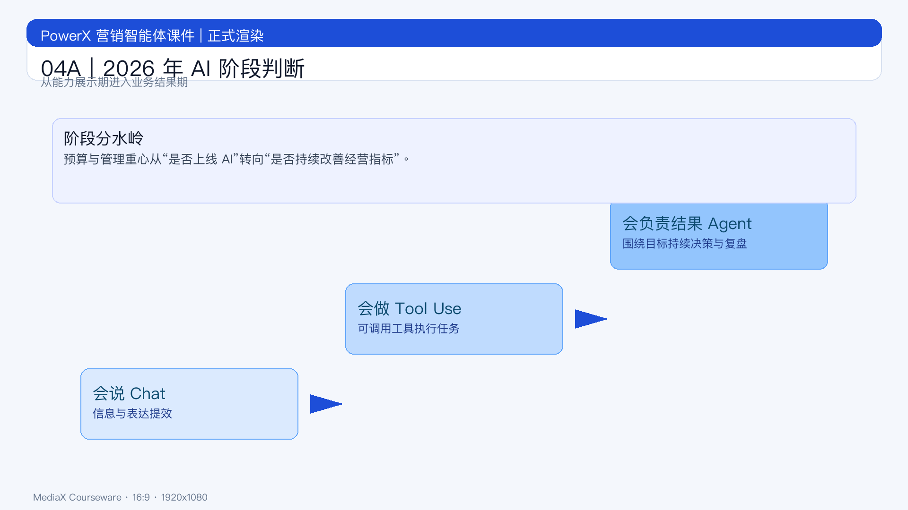

# 页面 04A｜2026 年 AI 阶段判断

## 页面目标
统一认知：2026 年 AI 的主战场已从“模型能力演示”转向“业务结果交付”。

## 页面展示

### 页面结构
- 顶部：结论标题
  - `2026：AI 从工具时代进入结果时代`
- 中部：三层演进阶梯
  - `会说（Chat） -> 会做（Tool Use） -> 会负责结果（Agent）`
- 底部：管理层判断句
  - `预算将优先流向“可稳定提升指标”的 AI 项目。`

### 上屏关键信息
- 阶段 1（会说）：提升信息处理效率
- 阶段 2（会做）：能执行离散任务
- 阶段 3（会负责结果）：围绕目标持续决策、执行、复盘

## 讲解提示
- 重点句 1：`能力展示不再稀缺，结果交付才稀缺。`
- 重点句 2：`AI 项目评估标准已从“是否上线”切到“是否增益经营”。`
- 过渡句：`下一页给出为什么这是“结果期”的三条证据。`

## 动效建议
1. 先出一句总判断。
2. 三层阶梯逐层出现。
3. 最后出现“预算流向”结论条。
