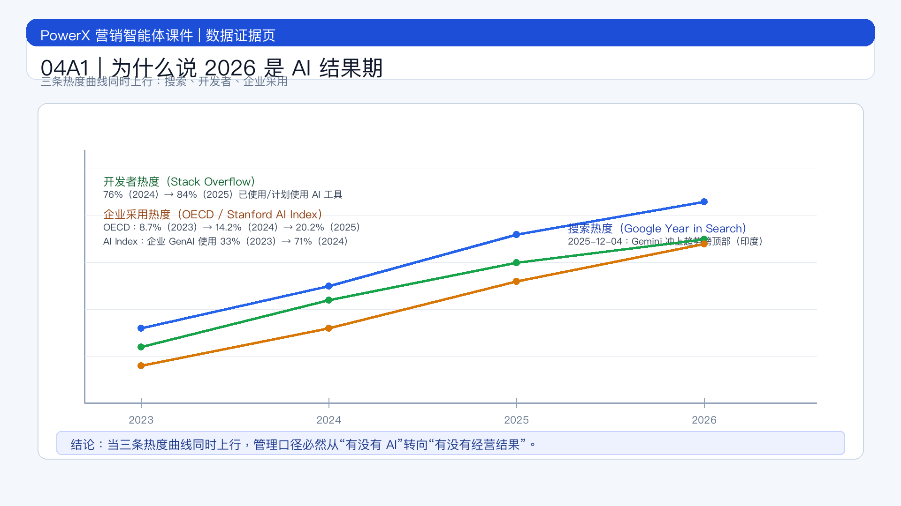

# 页面 04A1｜为什么说 2026 是 AI 结果期

## 页面目标
用“话题热度变化 + 采用率变化”证明：AI 已从概念热度进入结果竞争期。

## 页面展示

### 页面结构
- 顶部：标题区
  - `热度变化三条曲线：搜索热度、开发者热度、企业采用热度`
- 中部：三组数据（数据 + 时间 + 来源 +解读）
  - 证据 1｜搜索热度（用户侧）
    - 数据：Google 官方 `Year in Search 2025`（印度）明确写到 `Gemini soared to the top of trending charts`（Gemini 冲上年度趋势榜顶部）[^1]。
    - 时间：2025-12-04
    - 解读：AI 相关话题从“科技圈热词”变成大众持续检索对象。
  - 证据 2｜开发者热度（生产侧）
    - 数据：Stack Overflow Developer Survey：`76% (2024) -> 84% (2025)` 的受访者表示“已使用或计划使用 AI 工具”[^2]。
    - 时间：2025-07-29（2025 报告发布时间）
    - 解读：AI 从“尝鲜工具”变为默认工作流组件。
  - 证据 3｜企业采用热度（组织侧）
    - 数据 A（OECD）：企业 AI 使用率 `8.7% (2023) -> 14.2% (2024) -> 20.2% (2025)`[^3]。
    - 数据 B（Stanford AI Index 引 McKinsey）：企业在至少一个业务功能使用生成式 AI，`33% (2023) -> 71% (2024)`[^4]。
    - 时间：2025-2026 官方发布
    - 解读：组织层面正在快速穿越试点期，进入规模化落地期。
- 底部：收口句
  - `当搜索热度、开发热度、企业采用率同时抬升，管理口径必然从“有没有 AI”转向“有没有经营结果”。`

### 证据强弱说明（给讲师）
- 证据 1：平台级搜索趋势（大众注意力证据）。
- 证据 2：开发者年度调查（生产端采用证据）。
- 证据 3：国家/跨行业统计（企业端落地证据）。

## 讲解提示
- 按“用户热度 -> 生产热度 -> 企业热度”顺序讲。
- 口播重点：`不是一句“AI 很火”，而是三条曲线同时上行。`
- 过渡到自测页：`既然进入结果期，我们先定位团队现在在哪一层。`

## 脚注来源（讲师版）
[^1]: Google Blog (India). *India’s Year in Search 2025*. Published December 4, 2025. https://blog.google/intl/en-in/products/explore-communicate/indias-year-in-search-2025/
[^2]: Stack Overflow. *Developer Survey 2025: AI*. Published July 29, 2025. https://survey.stackoverflow.co/2025/ai
[^3]: OECD. *AI use by individuals surges across the OECD as adoption by firms continues to expand*. Published January 28, 2026. https://www.oecd.org/en/about/news/announcements/2026/01/ai-use-by-individuals-surges-across-the-oecd-as-adoption-by-firms-continues-to-expand.html
[^4]: Stanford HAI. *AI Index Report 2025 – Economy*. Published 2025. https://hai.stanford.edu/ai-index/2025-ai-index-report/economy
