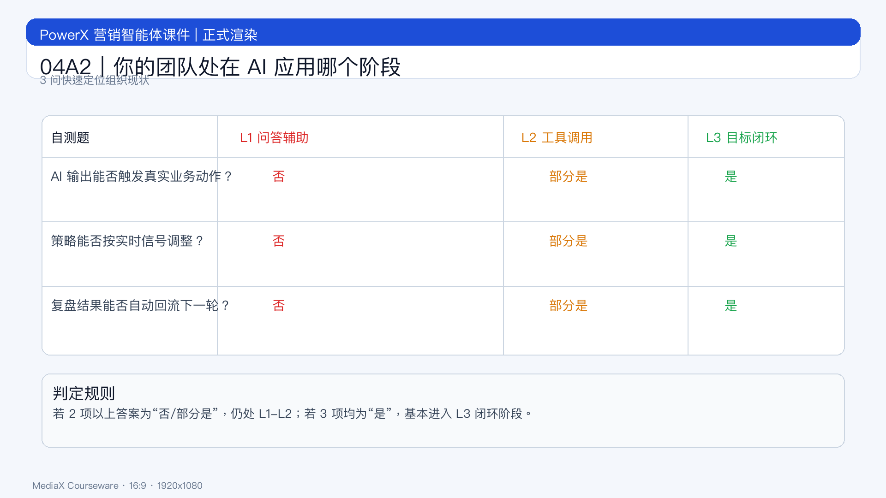

# 页面 04A2｜你的团队处在 AI 应用哪个阶段

## 页面目标
通过快速自测完成组织定位，明确是否具备进入“结果期”的条件。

## 页面展示

### 页面结构
- 顶部：问题标题
  - `你的团队在哪一层？`
- 中部：三层定位表 + 3 个自测问题
  - L1：问答辅助
  - L2：工具调用
  - L3：目标闭环
- 底部：升级提示
  - `若仍靠人工串联执行与复盘，尚未进入闭环层。`

### 自测题
- Q1：AI 输出是否直接触发真实业务动作？
- Q2：策略是否可根据实时信号自动调节？
- Q3：复盘结果是否回流到下一轮策略？

### 判定规则
- 2 项以上“否”：处于 L1/L2
- 3 项“是”：接近 L3

## 讲解提示
- 要求学员按“当前真实状态”作答。
- 过渡句：`定位完成后，进入模块 B，看链路如何被重构。`
