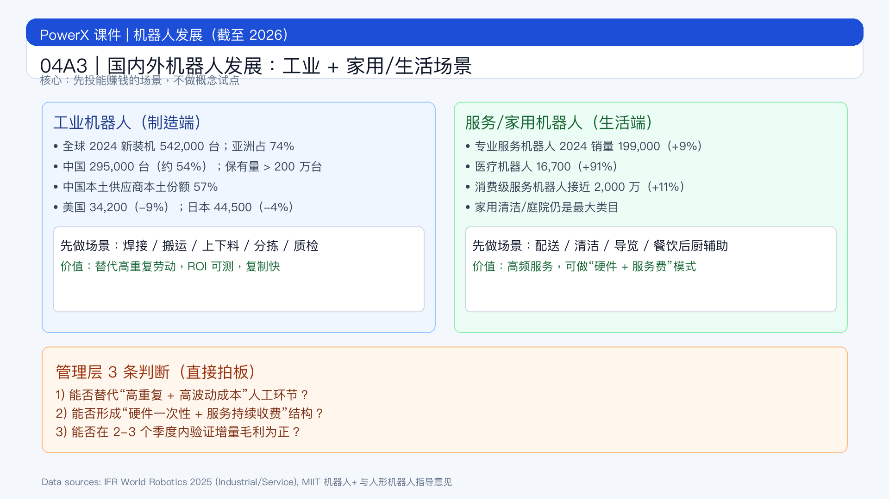

# 页面 04A3｜机器人发展（截至 2026）：国内外对比

## 页面目标
把“机器人发展”讲成可决策信息：工业端看生产力，家用/生活端看渗透率与复购，最后落到企业该先投什么场景。

## 页面展示

### 页面结构
- 顶部：结论标题
  - `2026 的机器人，不是“有没有”，而是“先在哪些场景赚钱”`
- 中部：国内外发展对比（工业 + 服务/家用）
  - 工业机器人（全球制造场景）
    - 2024 年全球工业机器人新装机 `542,000` 台；亚洲占 `74%`[^1]
    - 中国 2024 年新装机 `295,000` 台，占全球约 `54%`；保有量超过 `200 万` 台；中国本土供应商在本土市场份额达 `57%`[^1]
    - 美国 2024 年新装机 `34,200` 台（同比 -9%），日本 `44,500` 台（同比 -4%）[^1]
  - 服务/家用机器人（生活与商业场景）
    - 2024 年专业服务机器人销量约 `199,000` 台（同比 +9%）[^2]
    - 其中医疗机器人约 `16,700` 台（同比 +91%）[^2]
    - 2024 年消费级服务机器人销量接近 `2,000 万` 台（同比 +11%），家用任务（扫地/割草等）仍是最大类目[^2]
- 底部：场景价值判断
  - `工业端：优先上“可直接替代高重复劳动”的工位；`
  - `生活端：优先上“高频、标准化、可订阅”的服务。`

### 场景地图（给业务方）
- 工业高确定性场景（先做）
  - 焊接、搬运、上下料、分拣、质检、仓内物流
  - 特征：流程标准、ROI 可测、替人效应强
- 商用生活场景（次优先）
  - 园区/商场配送、地面清洁、前台导览、餐饮后厨辅助
  - 特征：劳动密集、夜间作业价值高、可按服务费计费
- 家用场景（看渠道和复购）
  - 清洁、庭院、看护/陪伴（受政策和支付能力影响更大）
  - 特征：规模大，但需要品牌与售后体系支撑

### 管理层可直接用的 3 条判断
1. 是否替代“高重复 + 高波动成本”的人工环节？
2. 是否能形成“硬件一次性 + 服务持续收费”的收入结构？
3. 是否能在 2-3 个季度内验证增量毛利为正？

## 讲解提示
- 重点句：`工业机器人解决“产能与一致性”，家用/服务机器人解决“人力与服务覆盖”。`
- 重点句：`国内优势在规模、供应链和落地速度；国外优势在高端零部件与系统生态。`
- 过渡句：`下一页回到你们团队：先选哪一类场景做试点。`

## 脚注来源（讲师版）
[^1]: International Federation of Robotics (IFR). *World Robotics 2025 – Industrial Robots*（2025-09-25 发布新闻摘要）. https://ifr.org/news/world-robotics-2025-report
[^2]: International Federation of Robotics (IFR). *World Robotics 2025 – Service Robots: Service Robots See Global Growth Boom*（2025-10-07）. https://ifr.org/ifr-press-releases/news/robot-race-
[^3]: 工业和信息化部等十七部门. 《“机器人+”应用行动实施方案》（工信部联通装〔2022〕187号，2023-01-18）. https://www.miit.gov.cn/threestrategy/zcgh/zlgh/art/2023/art_4c323e0c6861441c91b266a11c97ff2d.html
[^4]: 工业和信息化部. 《人形机器人创新发展指导意见》（工信部科〔2023〕193号，2023-10-20）. https://www.miit.gov.cn/jgsj/kjs/wjfb/art/2023/art_50316f76a9b1454b898c7bb2a5846b79.html
