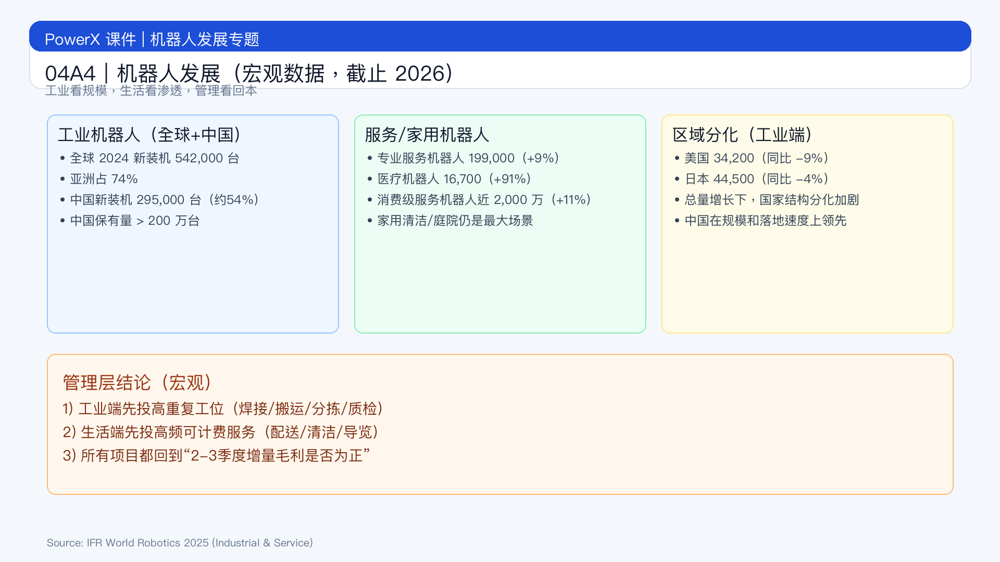

# 页面 04A4｜机器人发展（宏观数据，截止 2026）

## 页面目标
给管理层一页可读的宏观判断：全球和中国机器人发展到了哪一步，哪些赛道在加速，哪些赛道仍在试点。

## 页面展示

### 页面结构
- 顶部：一句判断
  - `机器人产业已进入“规模化渗透期”，但不同赛道成熟度差异很大`
- 中部：三组核心数据（工业 / 服务 / 区域）
  - 工业机器人（制造业）
    - 2024 年全球工业机器人新装机 `542,000` 台；亚洲占 `74%`[^1]
    - 中国 2024 年新装机 `295,000` 台，占全球约 `54%`[^1]
    - 中国工业机器人保有量已超 `200 万` 台[^1]
  - 服务机器人（专业 + 家用）
    - 2024 年专业服务机器人销量约 `199,000` 台（同比 +9%）[^2]
    - 其中医疗机器人约 `16,700` 台（同比 +91%）[^2]
    - 2024 年消费级服务机器人销量接近 `2,000 万` 台（同比 +11%）[^2]
  - 区域对比（工业机器人）
    - 美国：2024 年新装机 `34,200` 台（同比 -9%）[^1]
    - 日本：2024 年新装机 `44,500` 台（同比 -4%）[^1]
    - 结论：全球总量增长下，国家间结构性分化明显
- 底部：管理层结论
  - `工业端看“替人效率与一致性”，生活端看“高频任务与服务复购”。`

### 讲师话术（白话）
- `现在不是“机器人会不会来”，而是“先在哪个环节替人最值钱”。`
- `工业机器人已经是规模市场；生活机器人是快速扩张市场。`
- `同样叫机器人，成熟度完全不同：工业更确定，家用更看渠道与服务。`

### 管理层可直接用的 3 个判断
1. 这个场景是否“高重复 + 高人力成本 + 标准流程”？
2. 上线后 2-3 个季度能否看到增量毛利为正？
3. 能否形成“设备交付 + 维护/软件服务”的持续收入？

## 脚注来源（讲师版）
[^1]: International Federation of Robotics (IFR). *World Robotics 2025 – Industrial Robots*（发布信息，2025-09-24/25）. https://ifr.org/news/world-robotics-2025-report
[^2]: International Federation of Robotics (IFR). *Service Robots See Global Growth Boom*（2025-10-07）. https://ifr.org/ifr-press-releases/news/robot-race-
