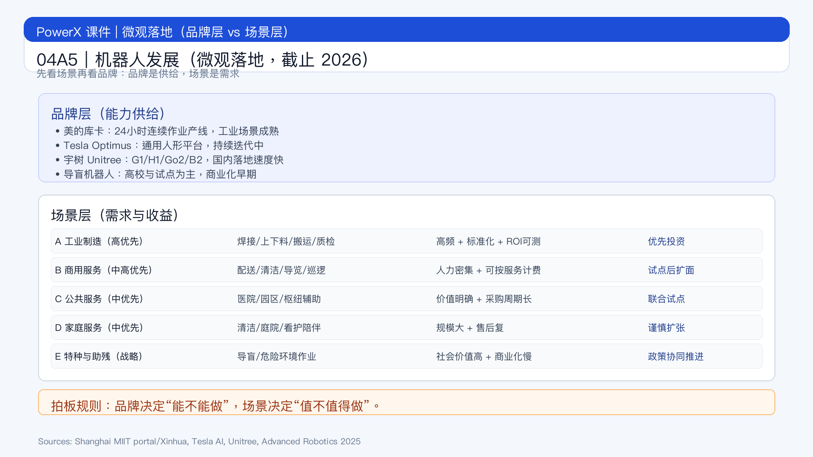

# 页面 04A5｜机器人发展（微观落地，截止 2026）

## 页面目标
把“品牌”和“场景”拆开讲：品牌用来理解技术路线，场景用来判断是否投钱。

## 页面展示

### 页面结构
- 顶部：一句判断
- 中部上半：品牌层（技术与产品能力）
  - 美的库卡（工业机器人 + 自动化产线）
    - 公开口径：顺德工厂机器人产线 24 小时连续作业，约每 30 分钟下线一台工业机器人[^1]
  - Tesla Optimus（通用人形平台）
    - 官方定位：面向通用劳动力场景，持续迭代软硬件能力[^2]
  - 宇树 Unitree（人形/四足）
    - 公开产品线：G1/H1 人形、Go2/B2 四足，面向科研教育、巡检与轻服务[^3]
  - 导盲机器人（助残方向）
    - 当前阶段：论文与试点多，商业化规模仍早期[^4]
- 中部下半：场景层（投资与落地优先级）
  - 场景 A｜工业制造：焊接、上下料、搬运、质检（高优先级）
  - 场景 B｜商用服务：配送、清洁、导览、安防巡逻（中高优先级）
  - 场景 C｜公共服务：医院/园区/交通枢纽辅助（中优先级）
  - 场景 D｜家庭服务：清洁、庭院、看护陪伴（中优先级，渠道与售后要求高）
  - 场景 E｜特种与助残：导盲、危险环境作业（高社会价值，商业化节奏慢）
- 底部：管理层拍板
  - `品牌决定“能不能做”，场景决定“值不值得做”。`

### 这页怎么讲（白话版）
- `先看场景，不要先看品牌。`
- `品牌是供给侧，场景是需求侧，预算要按需求侧走。`
- `导盲/助残是长期赛道，先跑试点与政策协同，不要硬上商业化KPI。`

### 只用这 3 条投前判断
1. 场景是否高频、标准化、可计费？
2. 项目是否有人工兜底与安全边界？
3. 2-3 个季度后能否验证增量毛利为正？

## 脚注来源（讲师版）
[^1]: 上海市经济和信息化委员会转载（新华社口径）. 《应用拓展 服务多元 人形机器人加速走来》, 2025-08-08. https://sheitc.sh.gov.cn/mtjj/20250808/4f01ac78ec2f481b8d473f6b86387743.html
[^2]: Tesla AI. *Optimus*. https://www.tesla.com/AI
[^3]: Unitree Robotics 官方产品页（G1/H1 等）. https://www.unitree.com/
[^4]: Kubota Y, et al. *A robotic guide dog based on reinforcement learning and vision-language model*. Advanced Robotics, 2025. https://www.tandfonline.com/doi/full/10.1080/01691864.2025.2519074
