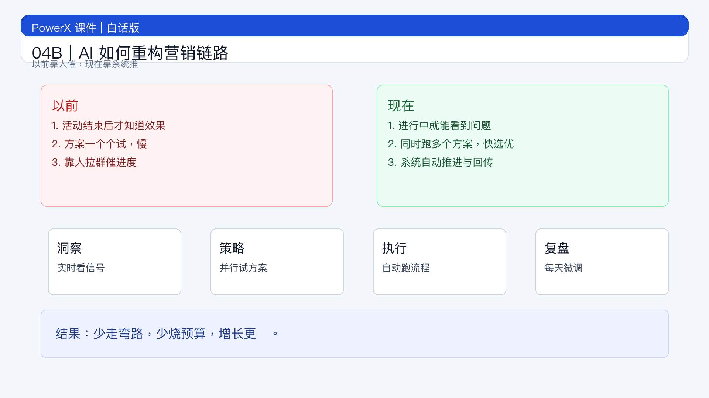

# 页面 04B｜AI 如何重构营销链路

## 页面目标
让听众 3 分钟听懂：营销链路到底哪里变了。

## 页面展示

### 页面结构
- 顶部：标题
  - `一句话：从“人盯流程”变成“系统盯结果”`
- 中部：链路总览图
  - `洞察 -> 策略 -> 执行 -> 复盘`
  - 过去做法：按周/月开会推进，慢
  - 现在做法：按天/小时自动调节，快
- 底部：结论条
  - `结果：少走弯路，少烧预算，增长更稳。`

### 以前 vs 现在（口语版）
- 洞察
  - 以前：活动结束才知道好不好
  - 现在：进行中就能看到哪里有问题
- 策略
  - 以前：一次只上一个方案
  - 现在：同时跑多个方案，快选优
- 执行
  - 以前：靠人催进度
  - 现在：系统自动推进
- 复盘
  - 以前：月底复盘
  - 现在：每天都在微调

### 为什么今天必须改（只保留 3 个数据）
- Google：AI 搜索入口覆盖 `200+` 国家和地区，用户行为已变[^1]
- Salesforce：`69%` 团队仍不能及时响应客户，说明旧流程太慢[^2]
- Stanford AI Index：企业 GenAI 使用从 `33%` 到 `71%`，竞争对手在加速[^3]

## 讲解提示
- 重点句：`这不是工具升级，是工作方式升级。`
- 过渡句：`下一页不讲概念，直接讲怎么管结果。`

## 脚注来源（讲师版）
[^1]: Google. *AI Overviews expand to over 200 countries and territories, more than 40 languages*. Published May 21, 2025. https://blog.google/products/search/ai-overview-expansion-may-2025-update/
[^2]: Salesforce. *State of Marketing 2026*. Published February 19, 2026. https://www.salesforce.com/news/stories/state-of-marketing-2026/
[^3]: Stanford HAI. *AI Index Report 2025 — Economy*. Published 2025. https://hai.stanford.edu/ai-index/2025-ai-index-report/economy
