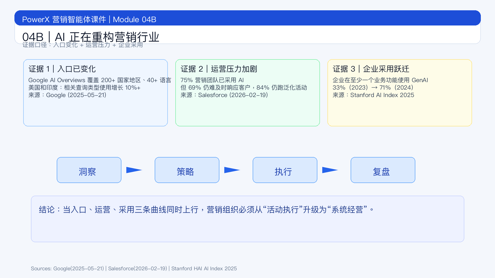

# 页面 04B｜AI 正在重构营销行业

## 页面目标
用公开数据证明“重构正在发生”，并明确重构对象是整条营销经营链路，而不是单点内容生产。

## 页面展示

### 页面结构
- 顶部：结论标题
  - `AI 重构营销，不是趋势判断，而是数据事实`
- 中部：三条证据（用户入口 / 行业运营 / 企业采用）
  - 用户入口变了：Google AI Overviews 已覆盖 `200+` 国家地区、`40+` 语言；在美国和印度，相关查询类型使用增长 `10%+`[^1]
  - 行业运营压力变了：`83%` 营销团队感知客户更期待双向沟通，但 `69%` 仍难及时回复、`84%` 仍在跑泛化活动[^2]
  - 企业采用强度变了：企业在至少一个业务功能使用 GenAI 比例 `33% -> 71%`（2023 到 2024）[^3]
- 底部：收口句
  - `当入口、运营、采用三条曲线同向上行，营销组织必然从“活动执行”转向“系统经营”。`

### 关键对照文案（用于口播）
- 洞察：从“月度看报表”到“实时读信号”
- 策略：从“少数人拍板”到“多策略并行试验”
- 执行：从“跨部门拉通”到“系统自动编排”
- 复盘：从“活动后总结”到“过程内调参”

## 讲解提示

### 时间分配（本页 3-4 分钟）
- 第 1 分钟：讲三条数据证据（先证据后观点）
- 第 2 分钟：讲链路四环节变化
- 第 3 分钟：讲组织能力迁移
- 第 4 分钟（可选）：引导学员对照本团队现状

### 讲师话术
- 开场：`我们先不谈观点，先看三条公开数据。`
- 过渡：`数据说明变化已经发生，问题只剩“组织是否完成升级”。`
- 收口：`下一页展开“链路怎么被重构”，再落到指标与能力。`

## 脚注来源（讲师版）
[^1]: Google. *AI Overviews expand to over 200 countries and territories, more than 40 languages*. Published May 21, 2025. https://blog.google/products/search/ai-overview-expansion-may-2025-update/
[^2]: Salesforce. *75% of Marketers Have Adopted AI Yet Still Use It To Send One-Way, Generic Campaigns* (State of Marketing 2026). Published February 19, 2026. https://www.salesforce.com/news/stories/state-of-marketing-2026/
[^3]: Stanford HAI. *AI Index Report 2025 — Economy*. Published 2025. https://hai.stanford.edu/ai-index/2025-ai-index-report/economy
