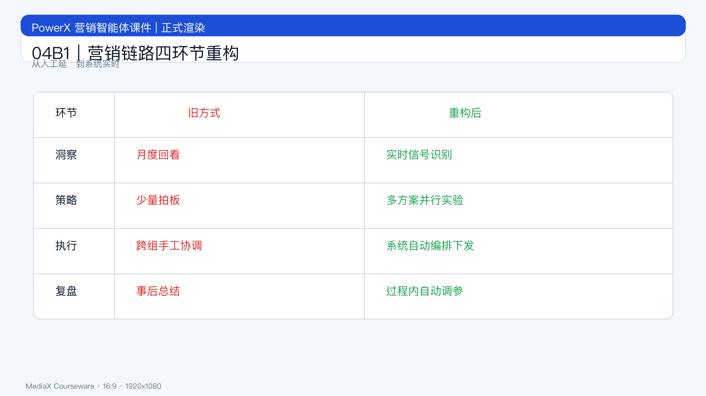

# 页面 04B1｜营销链路四环节重构

## 页面目标
把链路重构拆解到可执行动作，便于团队直接对照改造流程。

## 页面展示

### 页面结构
- 顶部：标题
  - `四环节怎么改`
- 中部：四行对照表
  - 洞察：月度回看 -> 实时信号识别
  - 策略：少量拍板 -> 多方案并行实验
  - 执行：跨组协调 -> 自动编排下发
  - 复盘：事后总结 -> 过程中调参
- 底部：关键句
  - `单环节优化不够，必须环节连通。`

### 落地动作
- 每环至少定义 1 个自动触发点
- 每周固定一次策略回放会
- 每月更新一版策略规则库

## 讲解提示
- 讲法顺序：洞察 -> 策略 -> 执行 -> 复盘。
- 过渡句：`改完之后，指标怎么衡量？下一页给标准。`
