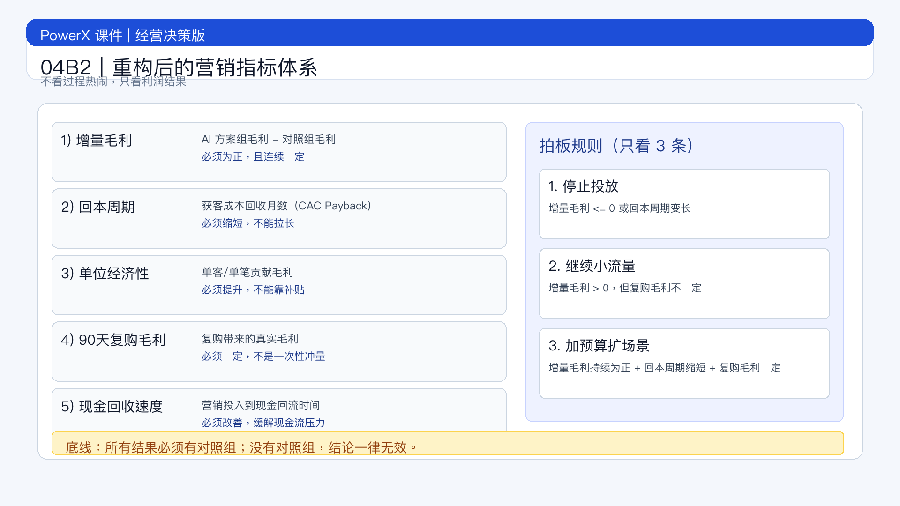

# 页面 04B2｜重构后的营销指标体系

## 页面目标
只保留对老板有意义的结果指标：判断 AI 营销到底赚没赚钱，是否继续投。

## 页面展示

### 页面结构
- 顶部：标题
  - `一句话：不看“忙不忙”，只看“赚没赚钱”`
- 中部：经营结果判定表（5 个硬指标）
  - 指标 1：增量毛利（Incremental Gross Profit）
    - 口径：AI 方案组毛利 - 对照组毛利
  - 指标 2：回本周期（CAC Payback Period）
    - 口径：获客成本回收需要几个月
  - 指标 3：单位经济性（Contribution Margin per Order / per Customer）
    - 口径：单笔或单客贡献毛利是否提升
  - 指标 4：复购质量（90 天复购率 + 复购毛利）
    - 口径：不是只看复购次数，要看复购是否赚钱
  - 指标 5：现金流压力（营销投入现金回收速度）
    - 口径：投放后现金回流是否改善
- 底部：治理提示
  - `底线：所有结果必须有对照组，否则一律不认定为“AI 带来收益”。`

### 只用这 3 条决策规则（可直接拍板）
- 规则 1：增量毛利 <= 0，或回本周期变长
  - 动作：立即止损，暂停扩量
- 规则 2：增量毛利 > 0，但复购毛利不稳定
  - 动作：保守运行，只做小流量迭代
- 规则 3：增量毛利持续为正 + 回本周期缩短 + 复购毛利稳定
  - 动作：加预算，扩场景复制

### 为什么必须看“利润口径”而不是“过程口径”
- 行业层面已经进入“采用率高、经营分化大”阶段：企业用 AI 的比例上升很快，但真正形成利润改善的仍是少数[^1][^3]
- 营销团队普遍面临“触达多、有效转化少”的问题，说明只看流程效率会误判[^2]

### 讲师引导
- `上一页讲“怎么做”，这页只回答“值不值得继续投”。`
- `管理层只需要盯住增量毛利和回本周期。`
- `不能证明利润改善的 AI 项目，一律按试验项目管理。`

## 讲解提示
- 过渡句：`管理规则有了，下一步才是组织能力建设。`

## 脚注来源（讲师版）
[^1]: Stanford HAI. *AI Index Report 2025 — Economy*（企业使用与业务影响趋势）. https://hai.stanford.edu/ai-index/2025-ai-index-report/economy
[^2]: Salesforce. *State of Marketing 2026*（营销组织响应与个性化压力）. https://www.salesforce.com/news/stories/state-of-marketing-2026/
[^3]: McKinsey. *The state of AI in 2025: Agents, innovation, and transformation*（企业经营影响与规模化挑战）. https://www.mckinsey.com/capabilities/quantumblack/our-insights/the-state-of-ai
