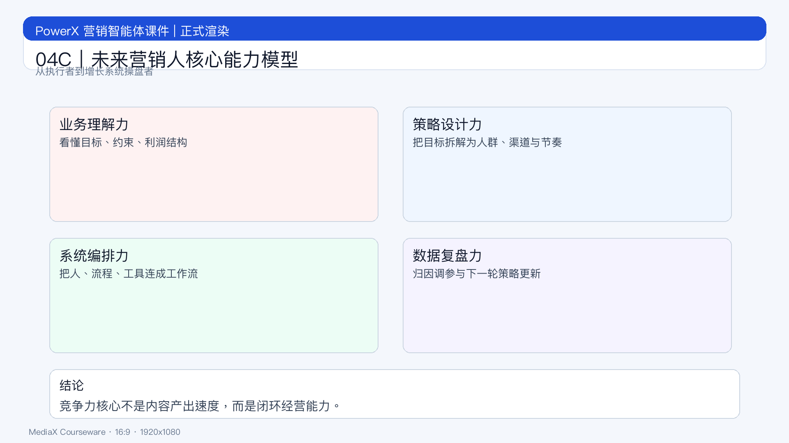

# 页面 04C｜未来营销人核心能力模型

## 页面目标
给出人才升级的统一框架，用于招聘、培养、考核对齐。

## 页面展示

### 页面结构
- 顶部：标题
  - `未来营销人，不是内容工种，而是增长系统操盘者`
- 中部：四力模型
  - 业务理解力
  - 策略设计力
  - 系统编排力
  - 数据复盘力
- 底部：结论条
  - `竞争力核心：闭环经营能力，而非单点产出速度。`

### 四力一句话定义
- 业务理解力：看懂目标、约束、利润结构
- 策略设计力：把目标拆成可执行策略组合
- 系统编排力：把人、流程、工具连成工作流
- 数据复盘力：从结果归因并驱动下一轮优化

## 讲解提示
- 强调“系统编排力”是新分水岭。
- 过渡句：`下一页看不同岗位的能力权重。`
