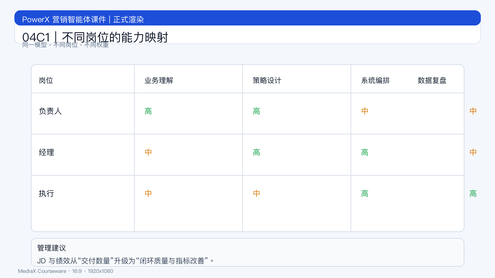

# 页面 04C1｜不同岗位的能力映射

## 页面目标
将四力模型映射到岗位职责，形成可执行的人才标准。

## 页面展示

### 页面结构
- 顶部：标题
  - `同一模型，不同岗位，不同权重`
- 中部：岗位能力矩阵
  - 负责人：业务理解 + 策略设计
  - 经理：策略设计 + 系统编排
  - 执行：系统编排 + 数据复盘
- 底部：管理结论
  - `岗位分工清晰，协同效率才会提升。`

### 用人建议
- 招聘 JD 从“平台经验”改为“闭环能力证据”
- 绩效从“交付数量”升级为“指标改善质量”

## 讲解提示
- 过渡句：`最后看如何在 90 天内完成能力升级。`
