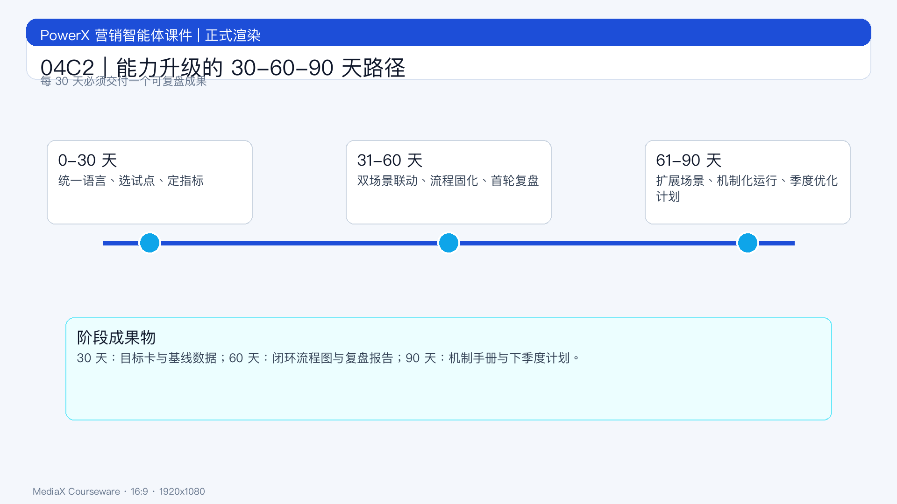

# 页面 04C2｜能力升级的 30-60-90 天路径

## 页面目标
给出组织可执行的能力升级路线，确保“学完即可开工”。

## 页面展示

### 页面结构
- 顶部：标题
  - `90 天完成从试用到闭环`
- 中部：路线图
  - 0-30 天：统一语言，选试点，定指标
  - 31-60 天：双场景联动，固化流程，开始回放
  - 61-90 天：扩展场景，建立月度机制
- 底部：验收口径
  - `每 30 天必须产出一个可复盘成果物。`

### 成果物建议
- 30 天：试点目标卡 + 基线数据
- 60 天：闭环流程图 + 首轮复盘报告
- 90 天：机制手册 + 下季度优化计划

## 讲解提示
- 重点句：`能力升级必须绑定业务任务，不是培训打卡。`
