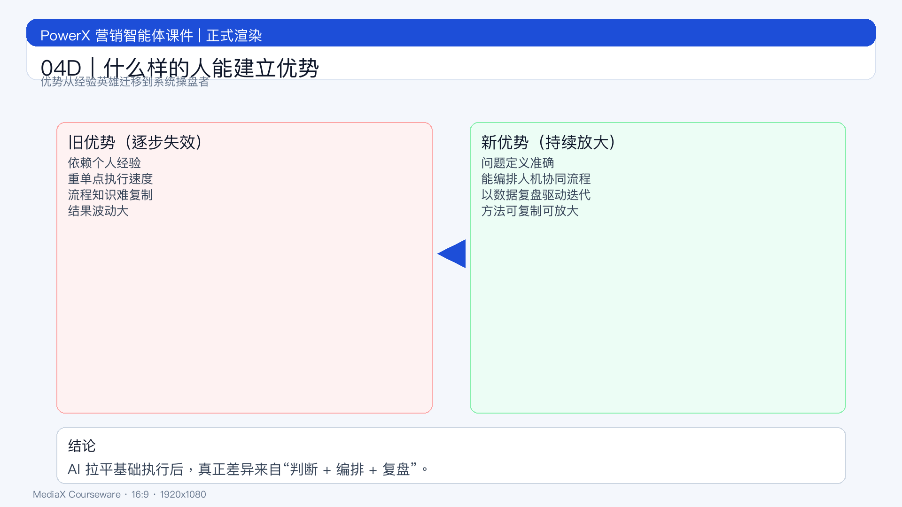

# 页面 04D｜什么样的人能建立优势

## 页面目标
明确优势迁移方向，帮助组织判断该培养什么人、激励什么行为。

## 页面展示

### 页面结构
- 顶部：标题
  - `优势正在迁移：从经验英雄到系统操盘者`
- 中部：旧优势 vs 新优势
  - 旧：经验强、执行快、依赖个人
  - 新：问题定义准、系统编排强、持续迭代快
- 底部：结论条
  - `AI 拉平基础能力后，真正差异来自“判断 + 编排 + 复盘”。`

## 讲解提示
- 重点句：`未来领先者不是“会用工具的人”，而是“能放大组织能力的人”。`
- 过渡句：`下一页给高优势人才的可观察行为。`
