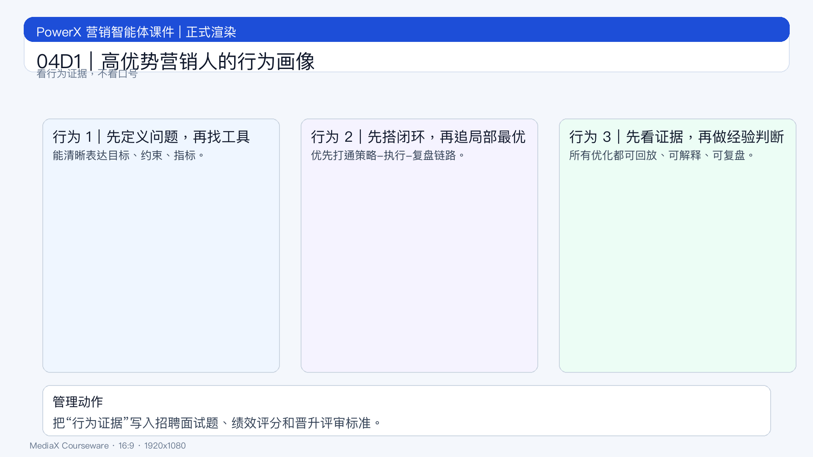

# 页面 04D1｜高优势营销人的行为画像

## 页面目标
把“优势”转成可观察行为，便于招聘、培训、晋升落地。

## 页面展示

### 页面结构
- 顶部：标题
  - `识别高优势人才：看行为，不看口号`
- 中部：三类核心行为
  - 行为 1：先定义问题，再找工具
  - 行为 2：先搭闭环，再追局部最优
  - 行为 3：先看证据，再做经验判断
- 底部：管理动作
  - `把行为证据写入绩效与晋升规则。`

### 行为证据示例
- 是否能提出清晰的“目标-约束-指标”定义
- 是否能主导一次跨角色闭环实验
- 是否能输出可复用的复盘模板

## 讲解提示
- 过渡句：`最后一页给 90 天行动清单，直接执行。`
