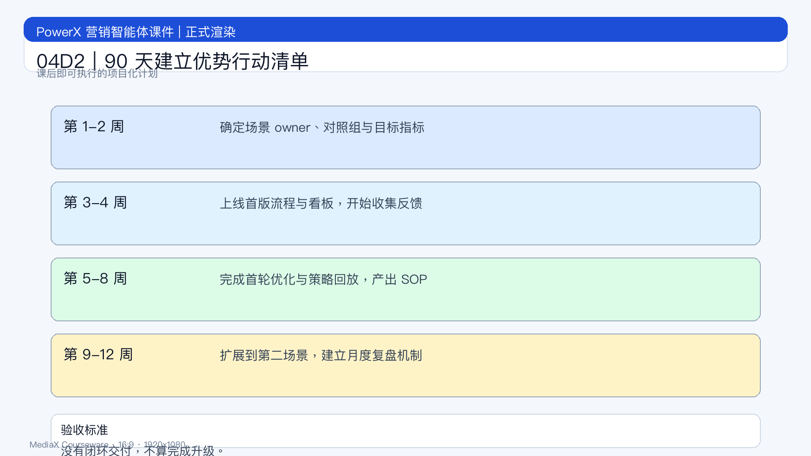

# 页面 04D2｜90 天建立优势行动清单

## 页面目标
把课程结论转成执行计划，确保课后 1 周内启动行动。

## 页面展示

### 页面结构
- 顶部：标题
  - `90 天，把优势变成组织能力`
- 中部：三阶段行动
  - 0-30 天：选 1 个高价值场景，定义 2 个核心指标
  - 31-60 天：跑通策略-执行-复盘闭环，形成 SOP
  - 61-90 天：扩展到第二场景，建立月度复盘机制
- 底部：承诺条
  - `没有闭环交付，不算完成升级。`

### 课后落地清单
- 第 1 周：确定场景 owner 与对照组
- 第 2-4 周：上线首版流程与看板
- 第 5-8 周：完成首轮优化与策略回放
- 第 9-12 周：扩展复制并固化机制

## 讲解提示
- 收口句：`从今天开始，团队目标不是“会用 AI”，而是“用 AI 稳定出结果”。`
