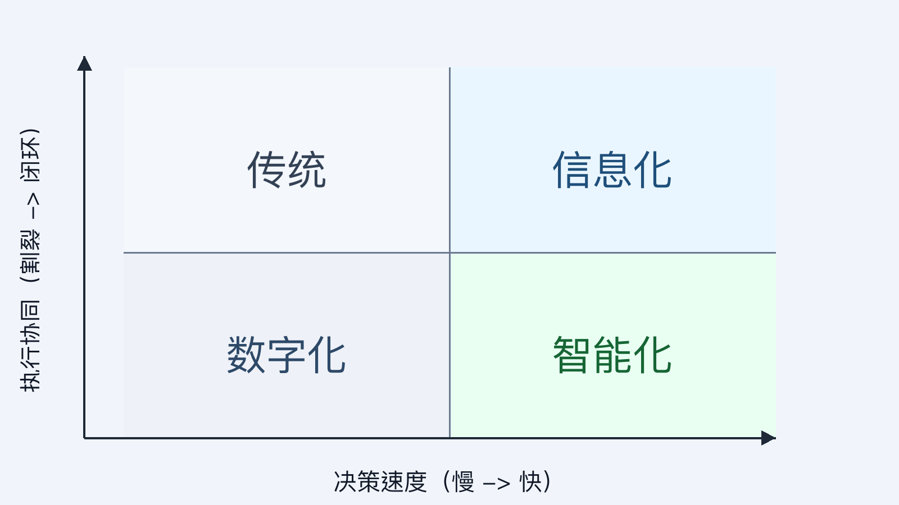

# 页面 07｜模块 A 小结：你在第几阶段？

## 页面目标
不再重复概念，用 1 次快速自测让学员判断自己所处阶段，并给出是否该进入智能化的判断依据。

## 页面展示（PPT 怎么做）

### 版式
- 顶部 20%：标题区
  - 主标题：`模块 A 小结：营销能力阶段定位`
  - 副标题：`阶段自测：从经验驱动到智能驱动`
- 中部 55%：四象限定位图
  - 横轴：`决策速度（慢 -> 快）`
  - 纵轴：`执行协同（割裂 -> 闭环）`
  - 四个区块标签：`传统`、`信息化`、`数字化`、`智能化`
- 底部 25%：升级判断条
  - 文案：`当渠道变化频率 > 团队人工响应频率，就必须进入营销智能化。`

### 可直接使用的图片

### 自测文案（可直接粘贴）
- 问题 1：策略调整主要靠周会拍板，还是系统持续建议？
- 问题 2：跨渠道动作主要靠群里协调，还是可自动编排？
- 问题 3：复盘是月度回看，还是实时反馈并自动调参？
- 判定规则：
  - 2 个及以上答案偏左侧：仍在前三阶段
  - 2 个及以上答案偏右侧：已具备智能化雏形

### 动效顺序（建议）
1. 先出现四象限与坐标轴，不放结论。
2. 再逐条出现 3 个自测问题，引导现场快速判断。
3. 最后出现底部“升级判断条”，并口播进入 B 模块。

## 讲述脚本（怎么讲）

### 时间分配（本页 2 分钟）
- 第 1 分钟：带做自测
  - 重点句：不看你买了多少工具，只看决策和协同是否跟得上变化。
- 第 2 分钟：收口到下一模块
  - 重点句：如果答案还偏“人驱动”，下一步就要搞清楚“智能体到底是什么”。

### 讲师话术（可直接用）
- 开场：`本页用于快速定位组织当前营销能力阶段。`
- 过渡：`请基于真实运行状态完成自测，不按目标状态作答。`
- 收口：`完成定位后，进入 B 模块说明智能体能力模型与落地方式。`

## 为什么这样设计

- 从“结论复述”改成“现场定位”
  - 原因：小结页的价值是促成判断和行动，不是重复定义。
- 用四象限替代雷达图
  - 原因：更直观地表达“现在在哪、下一步去哪”。
- 明确过渡到 B1
  - 原因：让课程节奏从 A 模块自然切入“智能体定义与机制”。
