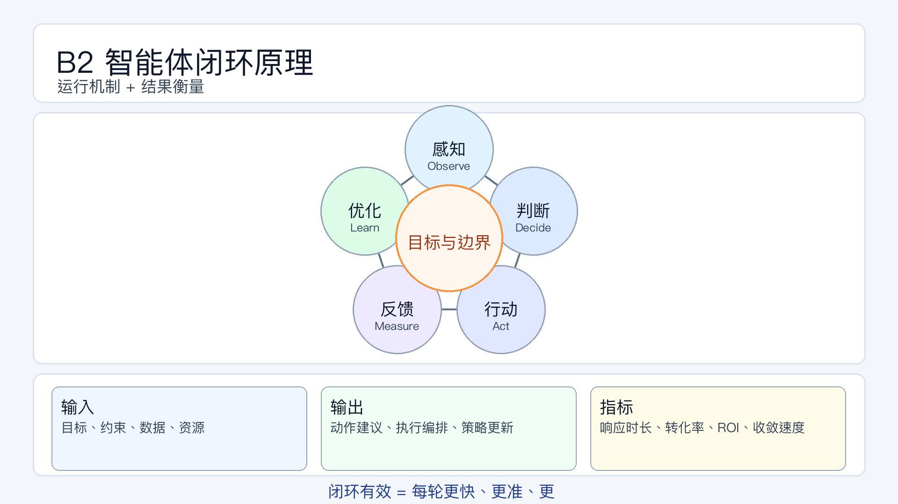

# 页面 09｜B2 智能体闭环原理（机制页）

## 页面目标
承接 B1 定义，回答“智能体怎么跑起来、怎么衡量是否跑好”。

## 页面展示（PPT 怎么做）

### 版式
- 顶部 20%：标题区
  - 主标题：`B2 智能体闭环原理`
  - 副标题：`运行机制 + 结果衡量`
- 中部 50%：五段闭环主图（环形或五边循环）
  - 节点 1：`感知（Observe）`
  - 节点 2：`判断（Decide）`
  - 节点 3：`行动（Act）`
  - 节点 4：`反馈（Measure）`
  - 节点 5：`优化（Learn）`
- 底部 30%：输入-输出-指标条
  - 输入：`目标、约束、数据、资源`
  - 输出：`动作建议、执行编排、策略更新`
  - 指标：`响应时长、转化率、ROI、策略收敛速度`

### 图上文案（可直接粘贴）
- 感知（Observe）
  - `读取行为、线索、活动、交易与渠道环境信号`
- 判断（Decide）
  - `基于目标与约束评估优先动作（谁、何时、用什么策略）`
- 行动（Act）
  - `触发触达、分配任务、调整预算/权益/节奏`
- 反馈（Measure）
  - `监测打开率、回复率、转化率、客单价、ROI`
- 优化（Learn）
  - `更新策略权重与参数，进入下一轮决策`
- 中心标签（放闭环中心）
  - `目标与边界`
- 底部指标解释（小字）
  - `看智能体是否有效，不只看执行量，要看“越来越准、越来越快”。`

### 动效顺序（建议）
1. 先显示中心词 `目标与边界`。
2. 再按顺时针依次出现 5 个节点与箭头。
3. 然后单独出现底部三条：输入 -> 输出 -> 指标。
4. 最后收口一句：`闭环有效 = 每轮更快、更准、更稳。`

## 讲述脚本（怎么讲）

### 时间分配（本页 3 分钟）
- 第 1 分钟：讲 5 步机制
  - 重点句：闭环是连续系统，不是串行任务清单。
- 第 2 分钟：讲输入与输出
  - 重点句：没有目标和约束，闭环会跑偏；没有输出编排，闭环就停在分析。
- 第 3 分钟：讲评估指标
  - 重点句：评估智能体要看结果质量和收敛速度，不只看“干了多少事”。

### 讲师话术（可直接用）
- 开场：`B1 讲清了定义，这一页只讲运行机制。`
- 过渡：`机制是否成立，取决于输入是否完整、输出是否可执行、指标是否可验证。`
- 收口：`下一页 B3 进入现实落地：当前阶段哪些环节已可稳定应用。`

## 为什么这样设计

- 把页面拆成“机制区 + 衡量区”
  - 原因：避免只讲流程不讲成效，提升落地可操作性。
- 强制给出输入/输出
  - 原因：帮助业务团队判断闭环为何跑不起来。
- 加入“收敛速度”指标
  - 原因：体现智能体价值来自迭代复利，而非一次表现。 

## 页面展示

