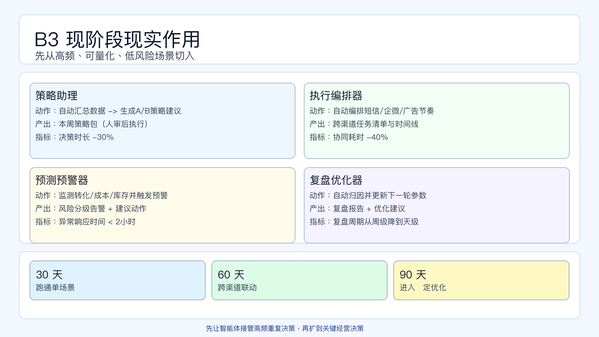

# 页面 10｜B3 现阶段现实作用（落地页）

## 页面目标
回答“现在就能用在哪、怎么起步、怎么衡量值不值”。

## 先讲一个场景（开场 20 秒）
- `上周大促前夜，团队还在群里追数、改文案、催投放；这页要解决的是：哪些动作今晚就可以让智能体先接手。`

## 页面展示（PPT 怎么做）

### 版式
- 顶部 20%：标题区
  - 主标题：`B3 现阶段现实作用`
  - 副标题：`先从高频、可量化、低风险场景切入`
- 中部 55%：四卡片实战场景（2x2）
  - 卡片 1：`策略助理`
  - 卡片 2：`执行编排器`
  - 卡片 3：`预测预警器`
  - 卡片 4：`复盘优化器`
- 底部 25%：90 天落地条（30-60-90）
  - `30 天跑通单场景`
  - `60 天跨渠道联动`
  - `90 天进入稳定优化`

### 图上文案（可直接粘贴）
- 策略助理（周度策略会）
  - 动作：`自动汇总数据 -> 生成A/B策略建议`
  - 产出：`本周策略包（人审后执行）`
  - 指标：`决策时长 -30%`
- 执行编排器（活动执行期）
  - 动作：`按目标人群自动编排短信/企微/广告节奏`
  - 产出：`跨渠道任务清单与时间线`
  - 指标：`协同耗时 -40%`
- 预测预警器（日常运营）
  - 动作：`监测转化、成本、库存波动并触发预警`
  - 产出：`风险分级告警 + 建议动作`
  - 指标：`异常响应时间 < 2小时`
- 复盘优化器（活动后）
  - 动作：`自动归因、沉淀经验、更新下一轮参数`
  - 产出：`复盘报告 + 下轮优化建议`
  - 指标：`复盘周期从周级降到天级`
- 底部结论条
  - `先让智能体接管“高频重复决策”，再扩到“关键经营决策”。`

### 动效顺序（建议）
1. 先出四个场景标题。
2. 每个卡片按“动作 -> 产出 -> 指标”逐条出现。
3. 最后出现 `30-60-90` 落地条，强调节奏化推进。

## 讲述脚本（怎么讲）

### 时间分配（本页 3 分钟）
- 第 1 分钟：讲“先做什么”
  - 重点句：优先做高频、可量化、可回滚的场景，不先碰高风险决策。
- 第 2 分钟：讲“怎么验证”
  - 重点句：每个场景必须绑定动作、产出、指标三件套。
- 第 3 分钟：讲“怎么扩面”
  - 重点句：先点状成功，再跨渠道联动，最后进入持续优化。

### 讲师话术（可直接用）
- 开场：`B3 不讨论愿景，只讨论今天能上手的场景。`
- 过渡：`如果一个场景没有明确指标，就不算落地，只是试用。`
- 收口：`下一页 B4 讲边界与治理，确保扩面过程中可控可审计。`

### 课堂互动（建议）
- 互动题：`四个场景里，你们团队下周最容易先落哪一个？`
- 举手选项：`策略助理 / 执行编排器 / 预测预警器 / 复盘优化器`
- 追问：`如果只能做一个，成功指标写哪一个数字？`

### 反例提醒（1 句话）
- `如果只上线“自动发内容”却没有复盘优化，这不是智能体落地，只是效率工具替换。`

## 为什么这样设计

- 每个场景固定“动作-产出-指标”
  - 原因：避免只讲功能，不讲业务结果。
- 增加 `30-60-90` 路径
  - 原因：给管理层可执行的推进节奏。
- 先低风险后高价值
  - 原因：提高首批试点成功率，减少组织阻力。

## 页面展示

