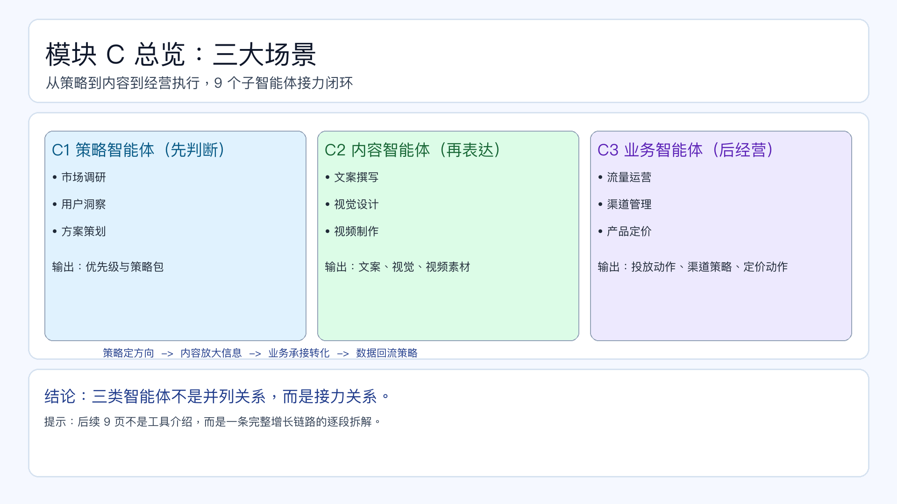

# 页面 13｜模块 C 总览：三大场景

## 页面目标
让学员先建立“全景地图”：为什么是这 3 类智能体，它们如何接力形成增长闭环。

## 先讲一个画面（开场 20 秒）
- `很多团队不是不会做营销，而是“策略、内容、执行”三段脱节。模块 C 的目标就是把这三段接成一条闭环链路。`

## 页面展示（PPT 怎么做）

### 版式
- 顶部 20%：标题区
  - 主标题：`模块 C 总览：三大场景`
  - 副标题：`从策略到内容到经营执行，9 个子智能体接力闭环`
- 中部 55%：3 列能力地图（每列 3 个子智能体）
  - C1 策略智能体：`市场调研 / 用户洞察 / 方案策划`
  - C2 内容智能体：`文案撰写 / 视觉设计 / 视频制作`
  - C3 业务智能体：`流量运营 / 渠道管理 / 产品定价`
- 底部 25%：协同链路条
  - `策略定方向 -> 内容放大信息 -> 业务承接转化 -> 数据回流策略`

### 图上文案（可直接粘贴）
- C1 策略智能体（先判断）
  - `回答“做什么、先做哪一块、为什么现在做”`
  - 输出：`优先级与策略包`
- C2 内容智能体（再表达）
  - `回答“用什么信息和创意打动目标人群”`
  - 输出：`文案、视觉、视频素材`
- C3 业务智能体（后经营）
  - `回答“怎么把策略和内容变成可衡量结果”`
  - 输出：`投放动作、渠道策略、定价动作`
- 结论条
  - `三类智能体不是并列关系，而是接力关系。`

### 动效顺序（建议）
1. 先出三列标题（策略 / 内容 / 业务）。
2. 再逐列出现每列的 3 个子智能体。
3. 最后出现底部接力链路与“数据回流”箭头。

## 讲述脚本（怎么讲）

### 时间分配（本页 2 分钟）
- 第 1 分钟：讲全景和接力关系
  - 重点句：没有策略，内容会飘；没有内容，业务承接会弱；没有业务闭环，策略无法迭代。
- 第 2 分钟：讲接下来怎么学
  - 重点句：后续 9 页不是 9 个工具介绍，而是一条完整增长链路的逐段拆解。

### 讲师话术（可直接用）
- 开场：`模块 C 不是“能力堆叠”，而是“链路接力”。`
- 过渡：`请带着一个问题听后面 9 页：这一段如何给下一段创造更高确定性。`
- 收口：`下一页从 C1 开始，先讲策略智能体如何定方向。`

### 课堂互动（建议）
- 互动题：`你们团队现在最薄弱的是策略、内容还是业务承接？`
- 追问：`如果只能补一段，补哪段对增长提升最快？`

### 反例提醒（1 句话）
- `只上内容智能体、不补策略和业务闭环，通常会出现“内容产能上去了，结果没有起来”。`

## 页面展示

