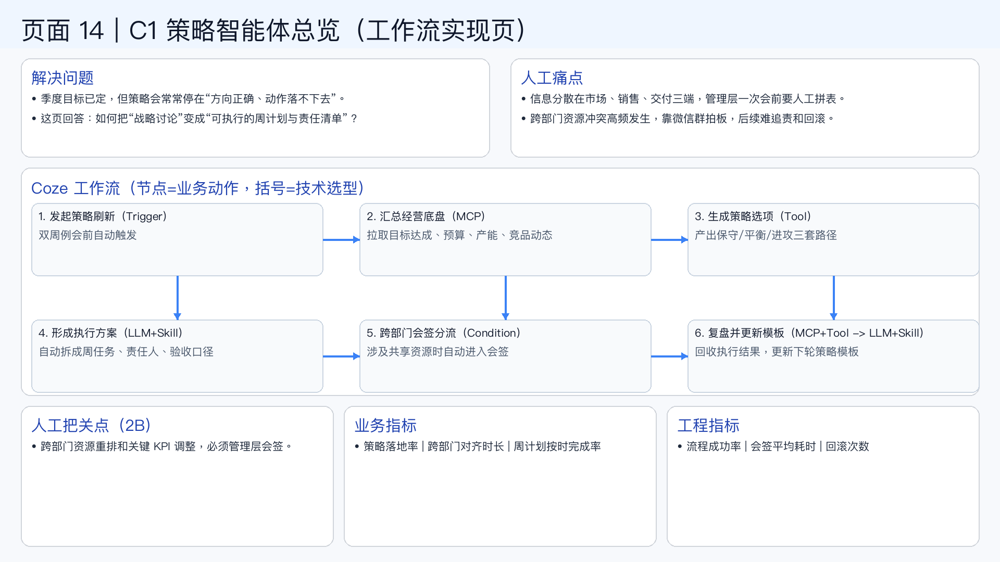

# 页面 14｜C1 策略智能体总览（工作流实现页）

## 这页解决什么问题
- `季度目标已定，但策略会常常停在“方向正确、动作落不下去”。`
- `这页回答：如何把“战略讨论”变成“可执行的周计划与责任清单”？`

## 人工方式为什么吃力
- `信息分散在市场、销售、交付三端，管理层一次会前要人工拼表。`
- `跨部门资源冲突高频发生，靠微信群拍板，后续难追责和回滚。`

## Coze 工作流（节点名=业务动作，括号=技术选型）
1. `发起策略刷新（Trigger）`
  - 双周例会前自动触发
2. `汇总经营底盘（MCP）`
  - 拉取目标达成、预算、产能、竞品动态
3. `生成策略选项（Tool）`
  - 产出保守/平衡/进攻三套路径
4. `形成执行方案（LLM+Skill）`
  - 自动拆成周任务、责任人、验收口径
5. `跨部门会签分流（Condition）`
  - 涉及共享资源时自动进入会签
6. `复盘并更新模板（MCP+Tool -> LLM+Skill）`
  - 回收执行结果，更新下轮策略模板

## 人工把关点（2B）
- 跨部门资源重排和关键 KPI 调整，必须管理层会签。

## 看结果的业务指标
- 策略落地率 | 跨部门对齐时长 | 周计划按时完成率

## 看系统稳定性的工程指标
- 流程成功率 | 会签平均耗时 | 回滚次数

## 页面展示

