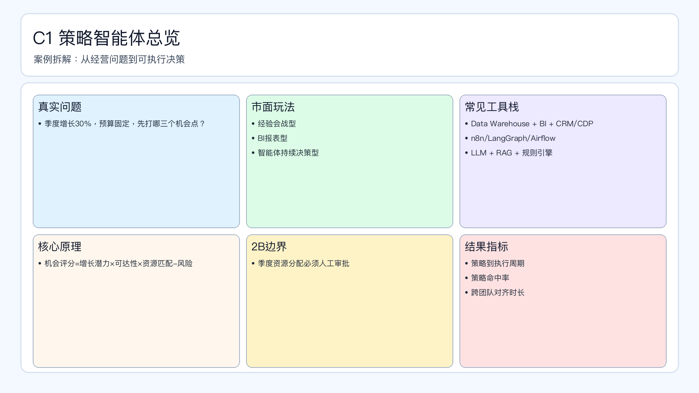

# 页面 14｜C1 策略智能体总览（业务决策页）

## 页面目标
先讲清业务问题和值得做智能体的理由，再进入实现细节。

## 本页解决问题
- `本季度增长目标已定，先打哪三条增长路径？`

## 为什么人工难做
- `周会拍板慢、跨部门对齐成本高、策略版本不可追踪`
- 决策过程依赖个人经验，稳定性与可追踪性不足。

## 这个决策是否高频
- `周级更新不够，建议双周滚动校准`

## 智能体给出的决策产出
- `输出优先级清单 + 资源建议 + 验收指标`
- 输出必须带理由、阈值和责任人，避免“黑盒建议”。

## 2B 边界
- `跨部门资源变更需负责人会签`

## 过渡到下一页
- 下一页展示：该场景在 Coze 里如何用工作流节点落地（含审批分支和回滚）。

## 页面展示

