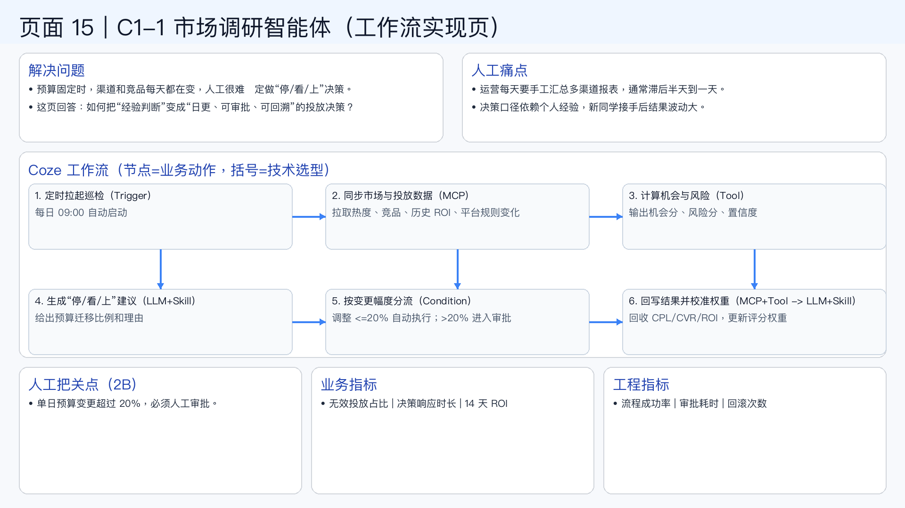

# 页面 15｜C1-1 市场调研智能体（工作流实现页）

## 这页解决什么问题
- `预算固定时，渠道和竞品每天都在变，人工很难稳定做“停/看/上”决策。`
- `这页回答：如何把“经验判断”变成“日更、可审批、可回溯”的投放决策？`

## 人工方式为什么吃力
- `运营每天要手工汇总多渠道报表，通常滞后半天到一天。`
- `决策口径依赖个人经验，新同学接手后结果波动大。`

## Coze 工作流（节点名=业务动作，括号=技术选型）
1. `定时拉起巡检（Trigger）`
  - 每日 09:00 自动启动
2. `同步市场与投放数据（MCP）`
  - 拉取热度、竞品、历史 ROI、平台规则变化
3. `计算机会与风险（Tool）`
  - 输出机会分、风险分、置信度
4. `生成“停/看/上”建议（LLM+Skill）`
  - 给出预算迁移比例和理由
5. `按变更幅度分流（Condition）`
  - 调整 <=20% 自动执行；>20% 进入审批
6. `回写结果并校准权重（MCP+Tool -> LLM+Skill）`
  - 回收 CPL/CVR/ROI，更新评分权重

## 人工把关点（2B）
- 单日预算变更超过 20%，必须人工审批。

## 看结果的业务指标
- 无效投放占比 | 决策响应时长 | 14 天 ROI

## 看系统稳定性的工程指标
- 流程成功率 | 审批耗时 | 回滚次数

## 页面展示

