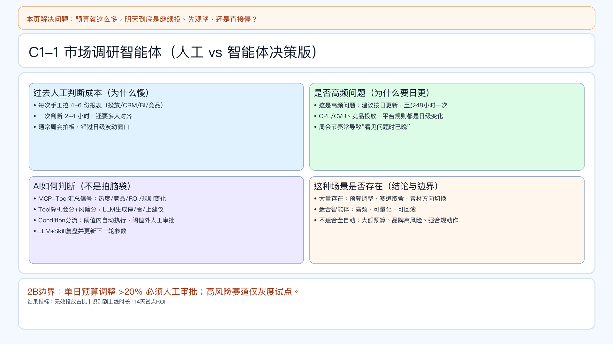

# 页面 15｜C1-1 市场调研智能体（业务决策页｜样板）

## 页面目标
回答“预算去留”这个高频问题：每天判断哪些赛道停、看、上，并把风险控制在阈值内。

## 本页解决问题
- `预算就这么多，明天到底是继续投、先观望，还是直接停？`

## 为什么人工难做
- 需要手工汇总多源信号（热度、竞品、平台规则、历史ROI）。
- 决策频率高（建议日更），人工周会节奏跟不上。
- 缺统一阈值与审计链路，容易“改了预算但说不清原因”。

## 这个问题是否适合智能体
- 适合：高频、可量化、可回滚。
- 不适合全自动：大额预算调整和高风险赛道投放。

## 智能体产出
- `停/看/上`动作建议。
- 建议预算比例与原因解释。
- 风险提示与审批建议。

## 2B 边界
- 单日预算调整 >20% 必须人工审批。
- 高风险赛道仅灰度试点。

## 页面展示

