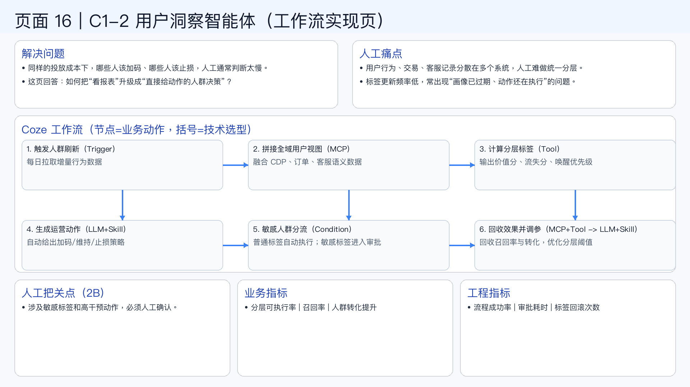

# 页面 16｜C1-2 用户洞察智能体（工作流实现页）

## 这页解决什么问题
- `同样的投放成本下，哪些人该加码、哪些人该止损，人工通常判断太慢。`
- `这页回答：如何把“看报表”升级成“直接给动作的人群决策”？`

## 人工方式为什么吃力
- `用户行为、交易、客服记录分散在多个系统，人工难做统一分层。`
- `标签更新频率低，常出现“画像已过期、动作还在执行”的问题。`

## Coze 工作流（节点名=业务动作，括号=技术选型）
1. `触发人群刷新（Trigger）`
  - 每日拉取增量行为数据
2. `拼接全域用户视图（MCP）`
  - 融合 CDP、订单、客服语义数据
3. `计算分层标签（Tool）`
  - 输出价值分、流失分、唤醒优先级
4. `生成运营动作（LLM+Skill）`
  - 自动给出加码/维持/止损策略
5. `敏感人群分流（Condition）`
  - 普通标签自动执行；敏感标签进入审批
6. `回收效果并调参（MCP+Tool -> LLM+Skill）`
  - 回收召回率与转化，优化分层阈值

## 人工把关点（2B）
- 涉及敏感标签和高干预动作，必须人工确认。

## 看结果的业务指标
- 分层可执行率 | 召回率 | 人群转化提升

## 看系统稳定性的工程指标
- 流程成功率 | 审批耗时 | 标签回滚次数

## 页面展示

