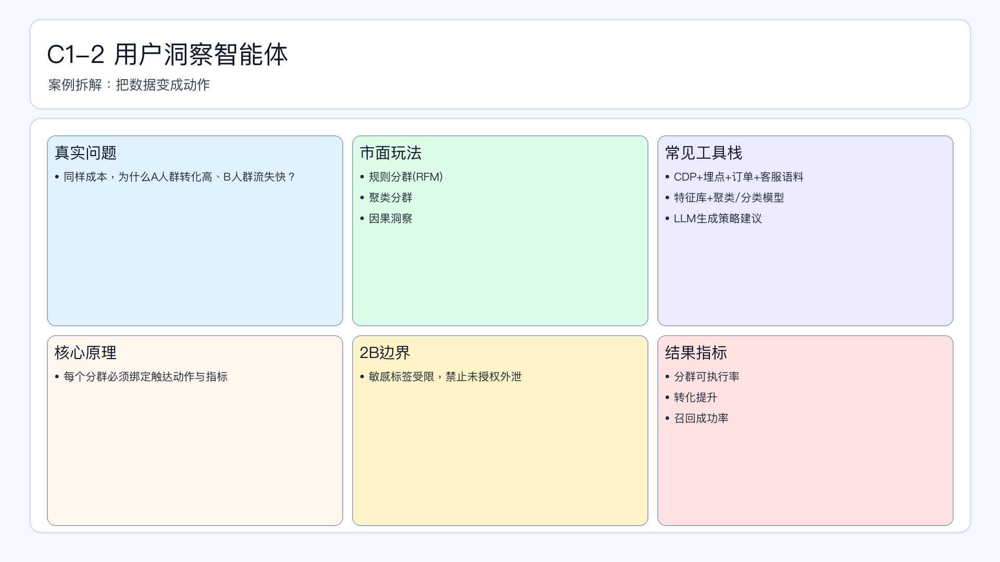

# 页面 16｜C1-2 用户洞察智能体（业务决策页｜样板）

## 页面目标
回答“人群要不要加码”的问题：把洞察转成分群动作，而不是停留在报告。

## 本页解决问题
- `同样成本下，哪些人群值得加码，哪些人群该止损？`

## 为什么人工难做
- 人群标签、行为数据、客服语义分散，人工整合慢。
- 洞察到动作常断层：知道问题但不知道下一步怎么做。
- 高频场景下（活动期）人工难以持续更新分群策略。

## 这个问题是否适合智能体
- 适合：可结构化分群、可量化转化目标。
- 不适合全自动：敏感标签、隐私相关人群决策。

## 智能体产出
- 人群分层（加码/维持/止损）。
- 各分层对应触达动作。
- 流失预警与召回建议。

## 2B 边界
- 敏感标签策略必须人工确认。
- 未授权用户数据不得参与分群计算。

## 页面展示

