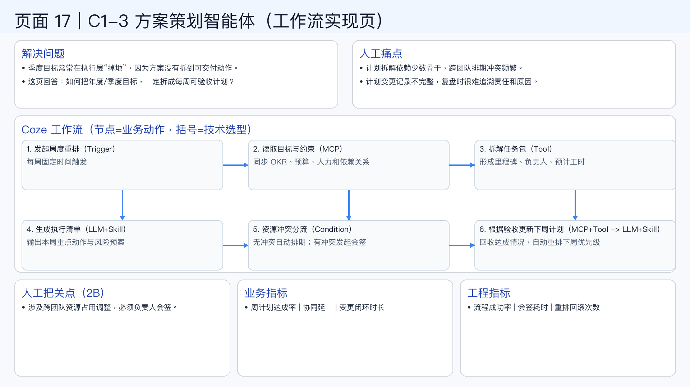

# 页面 17｜C1-3 方案策划智能体（工作流实现页）

## 这页解决什么问题
- `季度目标常常在执行层“掉地”，因为方案没有拆到可交付动作。`
- `这页回答：如何把年度/季度目标，稳定拆成每周可验收计划？`

## 人工方式为什么吃力
- `计划拆解依赖少数骨干，跨团队排期冲突频繁。`
- `计划变更记录不完整，复盘时很难追溯责任和原因。`

## Coze 工作流（节点名=业务动作，括号=技术选型）
1. `发起周度重排（Trigger）`
  - 每周固定时间触发
2. `读取目标与约束（MCP）`
  - 同步 OKR、预算、人力和依赖关系
3. `拆解任务包（Tool）`
  - 形成里程碑、负责人、预计工时
4. `生成执行清单（LLM+Skill）`
  - 输出本周重点动作与风险预案
5. `资源冲突分流（Condition）`
  - 无冲突自动排期；有冲突发起会签
6. `根据验收更新下周计划（MCP+Tool -> LLM+Skill）`
  - 回收达成情况，自动重排下周优先级

## 人工把关点（2B）
- 涉及跨团队资源占用调整，必须负责人会签。

## 看结果的业务指标
- 周计划达成率 | 协同延迟 | 变更闭环时长

## 看系统稳定性的工程指标
- 流程成功率 | 会签耗时 | 重排回滚次数

## 页面展示

