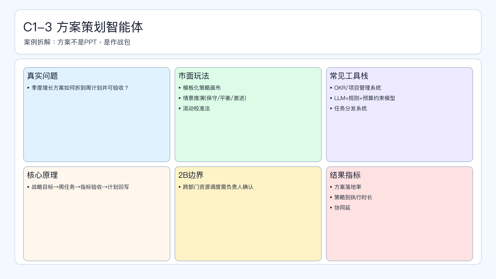

# 页面 17｜C1-3 方案策划智能体（业务决策页）

## 页面目标
先讲清业务问题和值得做智能体的理由，再进入实现细节。

## 本页解决问题
- `季度策略如何拆成可执行周计划并可验收？`

## 为什么人工难做
- `方案常停留在PPT，缺执行排程和验收口径`
- 决策过程依赖个人经验，稳定性与可追踪性不足。

## 这个决策是否高频
- `建议周级滚动修正`

## 智能体给出的决策产出
- `输出作战包（目标/路径/节奏/资源/指标）`
- 输出必须带理由、阈值和责任人，避免“黑盒建议”。

## 2B 边界
- `跨团队资源重排需人工确认`

## 过渡到下一页
- 下一页展示：该场景在 Coze 里如何用工作流节点落地（含审批分支和回滚）。

## 页面展示

