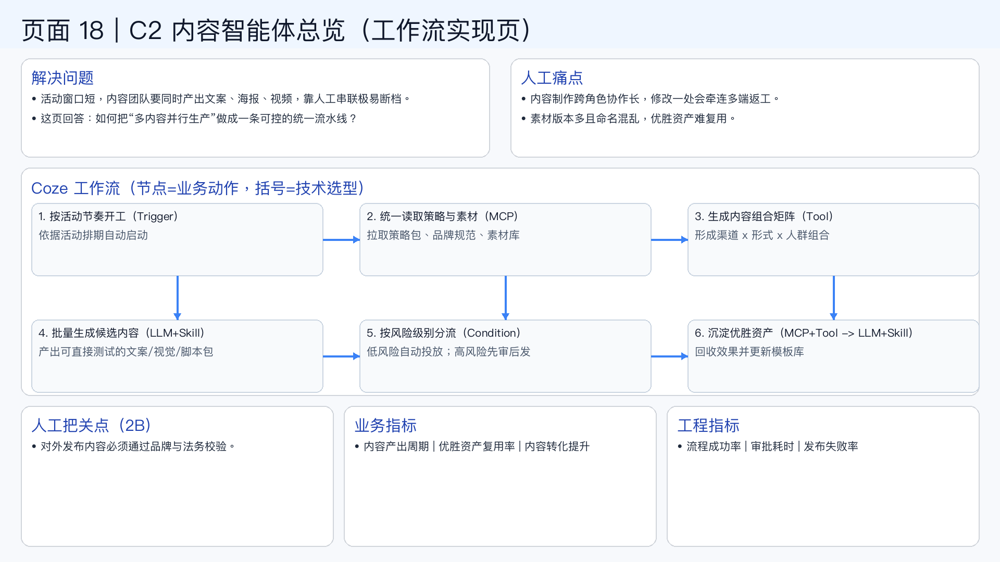

# 页面 18｜C2 内容智能体总览（工作流实现页）

## 这页解决什么问题
- `活动窗口短，内容团队要同时产出文案、海报、视频，靠人工串联极易断档。`
- `这页回答：如何把“多内容并行生产”做成一条可控的统一流水线？`

## 人工方式为什么吃力
- `内容制作跨角色协作长，修改一处会牵连多端返工。`
- `素材版本多且命名混乱，优胜资产难复用。`

## Coze 工作流（节点名=业务动作，括号=技术选型）
1. `按活动节奏开工（Trigger）`
  - 依据活动排期自动启动
2. `统一读取策略与素材（MCP）`
  - 拉取策略包、品牌规范、素材库
3. `生成内容组合矩阵（Tool）`
  - 形成渠道 x 形式 x 人群组合
4. `批量生成候选内容（LLM+Skill）`
  - 产出可直接测试的文案/视觉/脚本包
5. `按风险级别分流（Condition）`
  - 低风险自动投放；高风险先审后发
6. `沉淀优胜资产（MCP+Tool -> LLM+Skill）`
  - 回收效果并更新模板库

## 人工把关点（2B）
- 对外发布内容必须通过品牌与法务校验。

## 看结果的业务指标
- 内容产出周期 | 优胜资产复用率 | 内容转化提升

## 看系统稳定性的工程指标
- 流程成功率 | 审批耗时 | 发布失败率

## 页面展示

