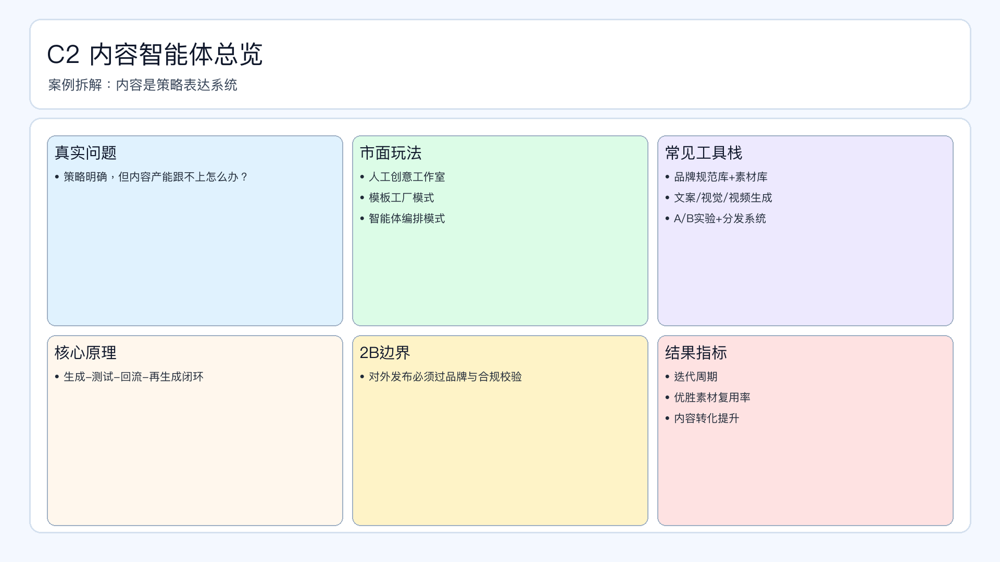

# 页面 18｜C2 内容智能体总览（业务决策页）

## 页面目标
先讲清业务问题和值得做智能体的理由，再进入实现细节。

## 本页解决问题
- `策略明确后，如何把内容产能和质量同时拉起来？`

## 为什么人工难做
- `内容链路长、版本测试慢、品牌一致性难保证`
- 决策过程依赖个人经验，稳定性与可追踪性不足。

## 这个决策是否高频
- `建议日更实验、周复盘优胜素材`

## 智能体给出的决策产出
- `输出文案/视觉/视频组合与投放建议`
- 输出必须带理由、阈值和责任人，避免“黑盒建议”。

## 2B 边界
- `对外内容发布必须通过品牌与合规校验`

## 过渡到下一页
- 下一页展示：该场景在 Coze 里如何用工作流节点落地（含审批分支和回滚）。

## 页面展示

