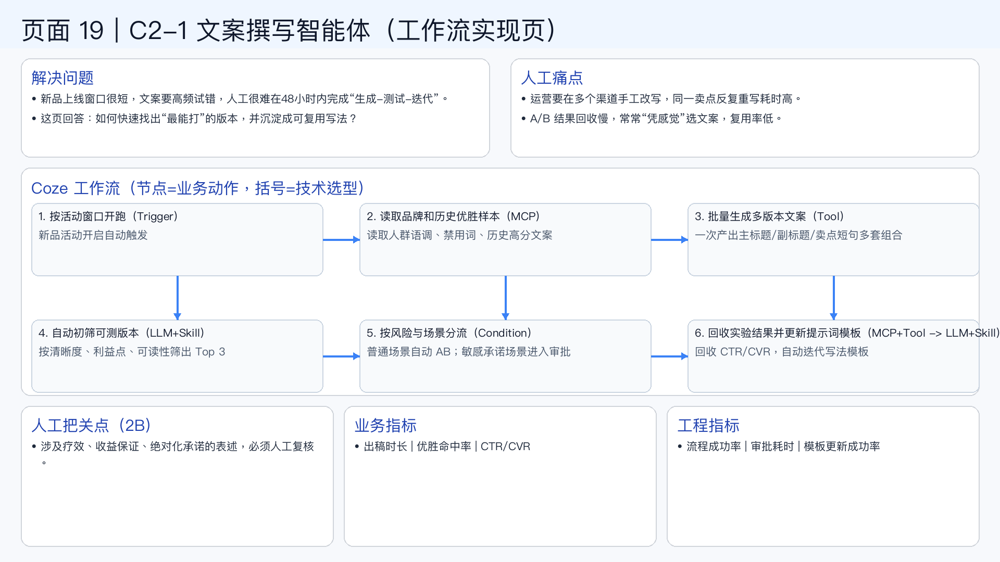

# 页面 19｜C2-1 文案撰写智能体（工作流实现页）

## 这页解决什么问题
- `新品上线窗口很短，文案要高频试错，人工很难在48小时内完成“生成-测试-迭代”。`
- `这页回答：如何快速找出“最能打”的版本，并沉淀成可复用写法？`

## 人工方式为什么吃力
- `运营要在多个渠道手工改写，同一卖点反复重写耗时高。`
- `A/B 结果回收慢，常常“凭感觉”选文案，复用率低。`

## Coze 工作流（节点名=业务动作，括号=技术选型）
1. `按活动窗口开跑（Trigger）`
  - 新品活动开启自动触发
2. `读取品牌和历史优胜样本（MCP）`
  - 读取人群语调、禁用词、历史高分文案
3. `批量生成多版本文案（Tool）`
  - 一次产出主标题/副标题/卖点短句多套组合
4. `自动初筛可测版本（LLM+Skill）`
  - 按清晰度、利益点、可读性筛出 Top 3
5. `按风险与场景分流（Condition）`
  - 普通场景自动 AB；敏感承诺场景进入审批
6. `回收实验结果并更新提示词模板（MCP+Tool -> LLM+Skill）`
  - 回收 CTR/CVR，自动迭代写法模板

## 人工把关点（2B）
- 涉及疗效、收益保证、绝对化承诺的表述，必须人工复核。

## 看结果的业务指标
- 出稿时长 | 优胜命中率 | CTR/CVR

## 看系统稳定性的工程指标
- 流程成功率 | 审批耗时 | 模板更新成功率

## 页面展示

