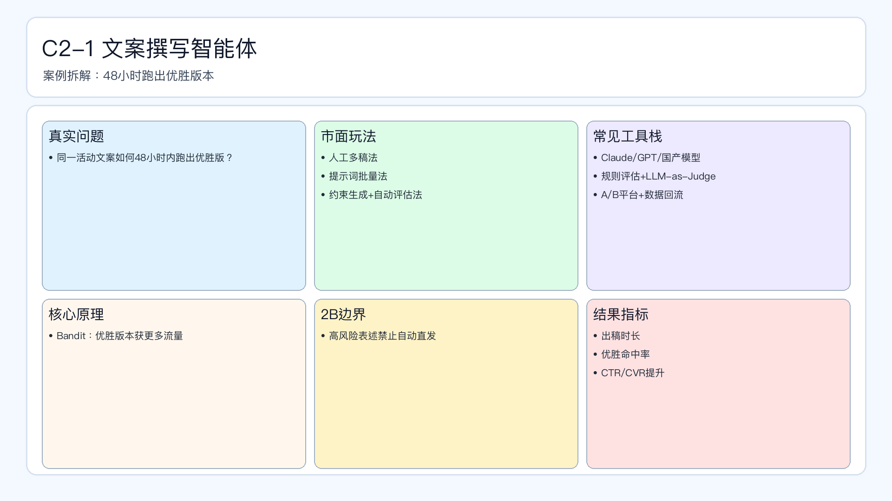

# 页面 19｜C2-1 文案撰写智能体（业务决策页）

## 页面目标
先讲清业务问题和值得做智能体的理由，再进入实现细节。

## 本页解决问题
- `同一活动文案如何在48小时内跑出优胜版本？`

## 为什么人工难做
- `人工多稿慢、实验节奏跟不上、优胜经验难沉淀`
- 决策过程依赖个人经验，稳定性与可追踪性不足。

## 这个决策是否高频
- `建议日级A/B实验`

## 智能体给出的决策产出
- `输出多版本文案+优胜建议+淘汰理由`
- 输出必须带理由、阈值和责任人，避免“黑盒建议”。

## 2B 边界
- `敏感表述与高风险承诺文案必须人工复核`

## 过渡到下一页
- 下一页展示：该场景在 Coze 里如何用工作流节点落地（含审批分支和回滚）。

## 页面展示

