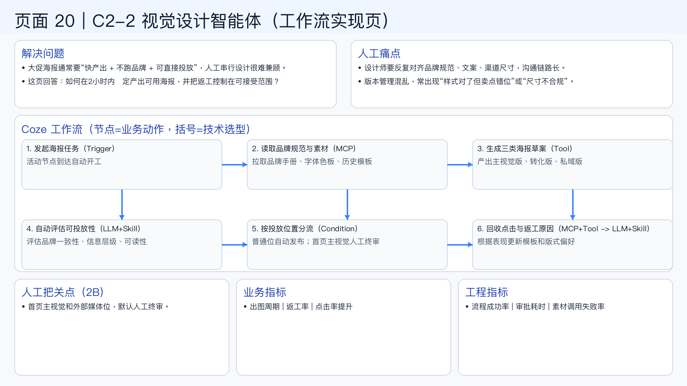

# 页面 20｜C2-2 视觉设计智能体（工作流实现页）

## 这页解决什么问题
- `大促海报通常要“快产出 + 不跑品牌 + 可直接投放”，人工串行设计很难兼顾。`
- `这页回答：如何在2小时内稳定产出可用海报，并把返工控制在可接受范围？`

## 人工方式为什么吃力
- `设计师要反复对齐品牌规范、文案、渠道尺寸，沟通链路长。`
- `版本管理混乱，常出现“样式对了但卖点错位”或“尺寸不合规”。`

## Coze 工作流（节点名=业务动作，括号=技术选型）
1. `发起海报任务（Trigger）`
  - 活动节点到达自动开工
2. `读取品牌规范与素材（MCP）`
  - 拉取品牌手册、字体色板、历史模板
3. `生成三类海报草案（Tool）`
  - 产出主视觉版、转化版、私域版
4. `自动评估可投放性（LLM+Skill）`
  - 评估品牌一致性、信息层级、可读性
5. `按投放位置分流（Condition）`
  - 普通位自动发布；首页主视觉人工终审
6. `回收点击与返工原因（MCP+Tool -> LLM+Skill）`
  - 根据表现更新模板和版式偏好

## 人工把关点（2B）
- 首页主视觉和外部媒体位，默认人工终审。

## 看结果的业务指标
- 出图周期 | 返工率 | 点击率提升

## 看系统稳定性的工程指标
- 流程成功率 | 审批耗时 | 素材调用失败率

## 页面展示

