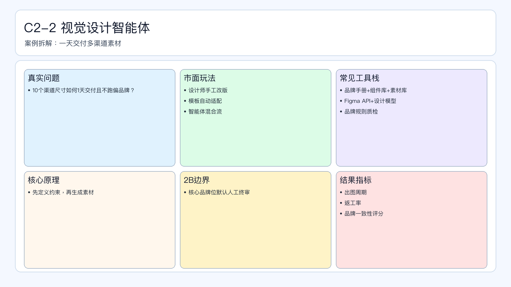

# 页面 20｜C2-2 视觉设计智能体（业务决策页）

## 页面目标
先讲清业务问题和值得做智能体的理由，再进入实现细节。

## 本页解决问题
- `多渠道多尺寸素材，如何一天内交付且不跑偏品牌？`

## 为什么人工难做
- `手工改版返工高、规范不统一、交付延迟`
- 决策过程依赖个人经验，稳定性与可追踪性不足。

## 这个决策是否高频
- `建议按活动批次日内迭代`

## 智能体给出的决策产出
- `输出多尺寸素材包+品牌一致性评分`
- 输出必须带理由、阈值和责任人，避免“黑盒建议”。

## 2B 边界
- `核心品牌位默认人工终审`

## 过渡到下一页
- 下一页展示：该场景在 Coze 里如何用工作流节点落地（含审批分支和回滚）。

## 页面展示

