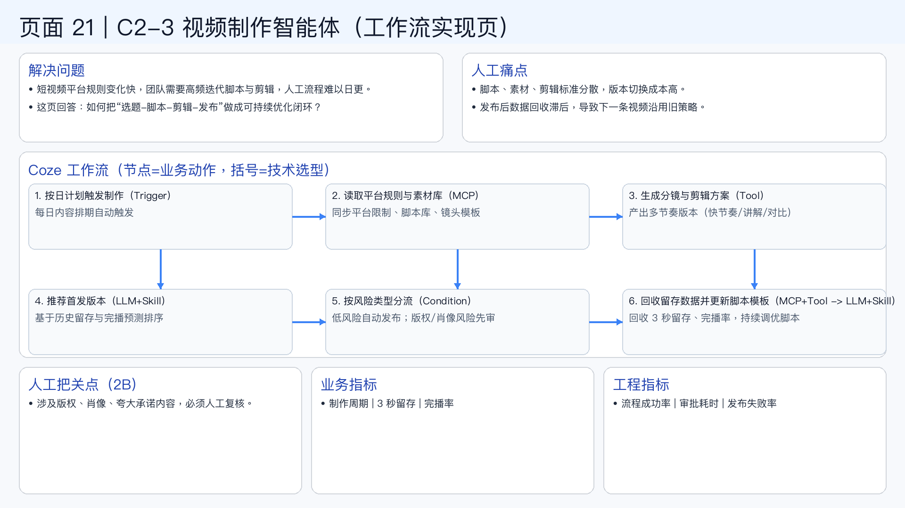

# 页面 21｜C2-3 视频制作智能体（工作流实现页）

## 这页解决什么问题
- `短视频平台规则变化快，团队需要高频迭代脚本与剪辑，人工流程难以日更。`
- `这页回答：如何把“选题-脚本-剪辑-发布”做成可持续优化闭环？`

## 人工方式为什么吃力
- `脚本、素材、剪辑标准分散，版本切换成本高。`
- `发布后数据回收滞后，导致下一条视频沿用旧策略。`

## Coze 工作流（节点名=业务动作，括号=技术选型）
1. `按日计划触发制作（Trigger）`
  - 每日内容排期自动触发
2. `读取平台规则与素材库（MCP）`
  - 同步平台限制、脚本库、镜头模板
3. `生成分镜与剪辑方案（Tool）`
  - 产出多节奏版本（快节奏/讲解/对比）
4. `推荐首发版本（LLM+Skill）`
  - 基于历史留存与完播预测排序
5. `按风险类型分流（Condition）`
  - 低风险自动发布；版权/肖像风险先审
6. `回收留存数据并更新脚本模板（MCP+Tool -> LLM+Skill）`
  - 回收 3 秒留存、完播率，持续调优脚本

## 人工把关点（2B）
- 涉及版权、肖像、夸大承诺内容，必须人工复核。

## 看结果的业务指标
- 制作周期 | 3 秒留存 | 完播率

## 看系统稳定性的工程指标
- 流程成功率 | 审批耗时 | 发布失败率

## 页面展示

