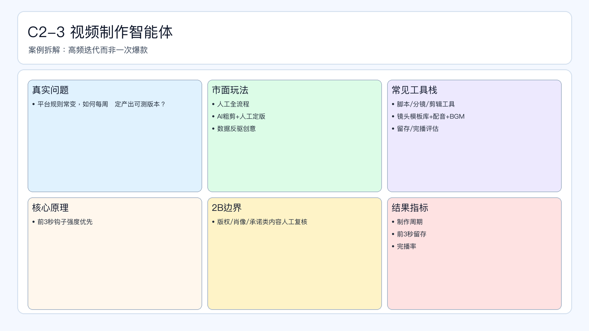

# 页面 21｜C2-3 视频制作智能体（业务决策页）

## 页面目标
先讲清业务问题和值得做智能体的理由，再进入实现细节。

## 本页解决问题
- `平台规则变化快，如何保持视频内容高频迭代？`

## 为什么人工难做
- `全人工链路慢、版本迭代跟不上、规则变更响应滞后`
- 决策过程依赖个人经验，稳定性与可追踪性不足。

## 这个决策是否高频
- `建议日更视频实验、周复盘脚本库`

## 智能体给出的决策产出
- `输出脚本/分镜/发布版本与优化建议`
- 输出必须带理由、阈值和责任人，避免“黑盒建议”。

## 2B 边界
- `版权肖像与合规承诺相关内容强制复核`

## 过渡到下一页
- 下一页展示：该场景在 Coze 里如何用工作流节点落地（含审批分支和回滚）。

## 页面展示

