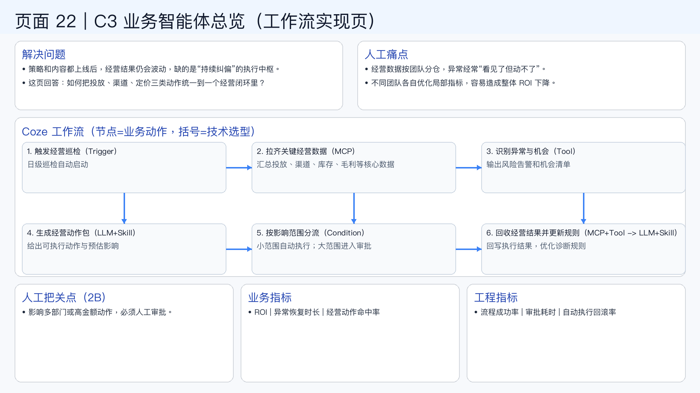

# 页面 22｜C3 业务智能体总览（工作流实现页）

## 这页解决什么问题
- `策略和内容都上线后，经营结果仍会波动，缺的是“持续纠偏”的执行中枢。`
- `这页回答：如何把投放、渠道、定价三类动作统一到一个经营闭环里？`

## 人工方式为什么吃力
- `经营数据按团队分仓，异常经常“看见了但动不了”。`
- `不同团队各自优化局部指标，容易造成整体 ROI 下降。`

## Coze 工作流（节点名=业务动作，括号=技术选型）
1. `触发经营巡检（Trigger）`
  - 日级巡检自动启动
2. `拉齐关键经营数据（MCP）`
  - 汇总投放、渠道、库存、毛利等核心数据
3. `识别异常与机会（Tool）`
  - 输出风险告警和机会清单
4. `生成经营动作包（LLM+Skill）`
  - 给出可执行动作与预估影响
5. `按影响范围分流（Condition）`
  - 小范围自动执行；大范围进入审批
6. `回收经营结果并更新规则（MCP+Tool -> LLM+Skill）`
  - 回写执行结果，优化诊断规则

## 人工把关点（2B）
- 影响多部门或高金额动作，必须人工审批。

## 看结果的业务指标
- ROI | 异常恢复时长 | 经营动作命中率

## 看系统稳定性的工程指标
- 流程成功率 | 审批耗时 | 自动执行回滚率

## 页面展示

