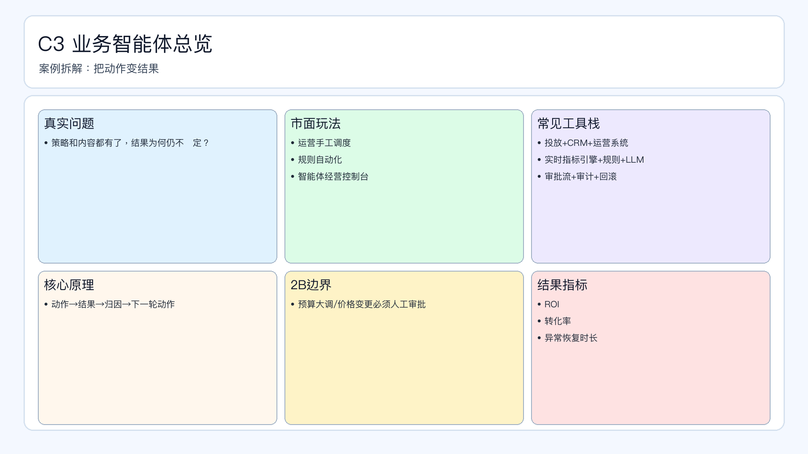

# 页面 22｜C3 业务智能体总览（业务决策页）

## 页面目标
先讲清业务问题和值得做智能体的理由，再进入实现细节。

## 本页解决问题
- `策略和内容都有了，为什么结果仍不稳定？`

## 为什么人工难做
- `执行链路分散、异常发现慢、结果回流慢`
- 决策过程依赖个人经验，稳定性与可追踪性不足。

## 这个决策是否高频
- `建议日级监控+周级策略修正`

## 智能体给出的决策产出
- `输出经营动作清单+异常处理建议`
- 输出必须带理由、阈值和责任人，避免“黑盒建议”。

## 2B 边界
- `高风险经营动作必须人工审批`

## 过渡到下一页
- 下一页展示：该场景在 Coze 里如何用工作流节点落地（含审批分支和回滚）。

## 页面展示

