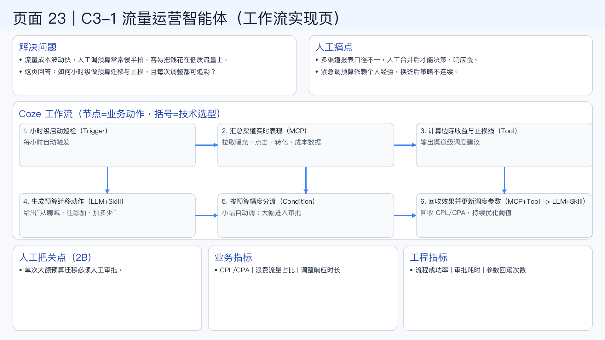

# 页面 23｜C3-1 流量运营智能体（工作流实现页）

## 这页解决什么问题
- `流量成本波动快，人工调预算常常慢半拍，容易把钱花在低质流量上。`
- `这页回答：如何小时级做预算迁移与止损，且每次调整都可追溯？`

## 人工方式为什么吃力
- `多渠道报表口径不一，人工合并后才能决策，响应慢。`
- `紧急调预算依赖个人经验，换班后策略不连续。`

## Coze 工作流（节点名=业务动作，括号=技术选型）
1. `小时级启动巡检（Trigger）`
  - 每小时自动触发
2. `汇总渠道实时表现（MCP）`
  - 拉取曝光、点击、转化、成本数据
3. `计算边际收益与止损线（Tool）`
  - 输出渠道级调度建议
4. `生成预算迁移动作（LLM+Skill）`
  - 给出“从哪减、往哪加、加多少”
5. `按预算幅度分流（Condition）`
  - 小幅自动调；大幅进入审批
6. `回收效果并更新调度参数（MCP+Tool -> LLM+Skill）`
  - 回收 CPL/CPA，持续优化阈值

## 人工把关点（2B）
- 单次大额预算迁移必须人工审批。

## 看结果的业务指标
- CPL/CPA | 浪费流量占比 | 调整响应时长

## 看系统稳定性的工程指标
- 流程成功率 | 审批耗时 | 参数回滚次数

## 页面展示

