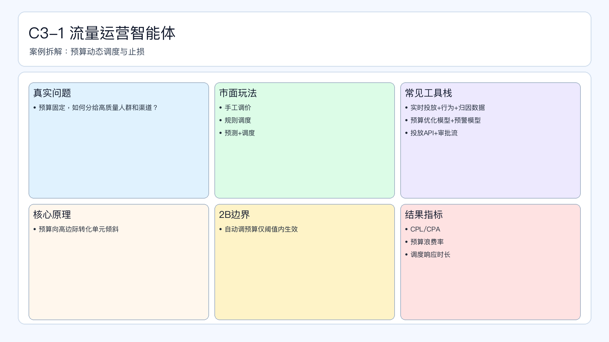

# 页面 23｜C3-1 流量运营智能体（业务决策页）

## 页面目标
先讲清业务问题和值得做智能体的理由，再进入实现细节。

## 本页解决问题
- `预算固定时，如何把钱持续投向高质量流量？`

## 为什么人工难做
- `人工调度慢、止损不及时、预算浪费不可控`
- 决策过程依赖个人经验，稳定性与可追踪性不足。

## 这个决策是否高频
- `建议小时级监控、日级调度`

## 智能体给出的决策产出
- `输出预算重分配建议+止损动作`
- 输出必须带理由、阈值和责任人，避免“黑盒建议”。

## 2B 边界
- `超阈值预算调整必须人工审批`

## 过渡到下一页
- 下一页展示：该场景在 Coze 里如何用工作流节点落地（含审批分支和回滚）。

## 页面展示

