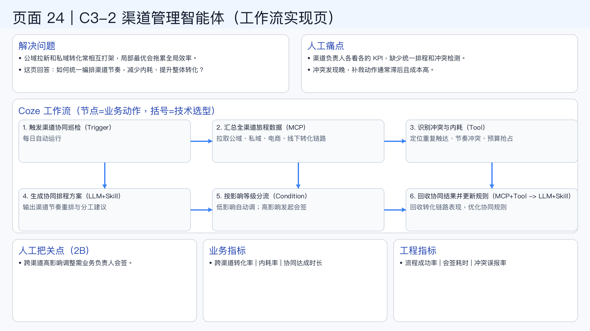

# 页面 24｜C3-2 渠道管理智能体（工作流实现页）

## 这页解决什么问题
- `公域拉新和私域转化常相互打架，局部最优会拖累全局效率。`
- `这页回答：如何统一编排渠道节奏，减少内耗、提升整体转化？`

## 人工方式为什么吃力
- `渠道负责人各看各的 KPI，缺少统一排程和冲突检测。`
- `冲突发现晚，补救动作通常滞后且成本高。`

## Coze 工作流（节点名=业务动作，括号=技术选型）
1. `触发渠道协同巡检（Trigger）`
  - 每日自动运行
2. `汇总全渠道旅程数据（MCP）`
  - 拉取公域、私域、电商、线下转化链路
3. `识别冲突与内耗（Tool）`
  - 定位重复触达、节奏冲突、预算抢占
4. `生成协同排程方案（LLM+Skill）`
  - 输出渠道节奏重排与分工建议
5. `按影响等级分流（Condition）`
  - 低影响自动调；高影响发起会签
6. `回收协同结果并更新规则（MCP+Tool -> LLM+Skill）`
  - 回收转化链路表现，优化协同规则

## 人工把关点（2B）
- 跨渠道高影响调整需业务负责人会签。

## 看结果的业务指标
- 跨渠道转化率 | 内耗率 | 协同达成时长

## 看系统稳定性的工程指标
- 流程成功率 | 会签耗时 | 冲突误报率

## 页面展示

