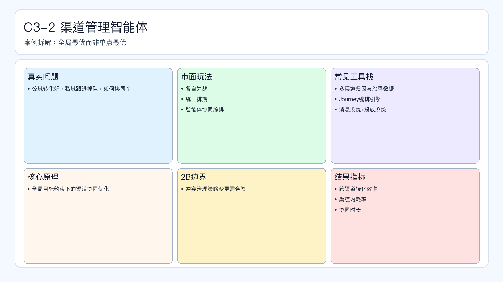

# 页面 24｜C3-2 渠道管理智能体（业务决策页）

## 页面目标
先讲清业务问题和值得做智能体的理由，再进入实现细节。

## 本页解决问题
- `公域与私域节奏冲突时，如何做全局最优？`

## 为什么人工难做
- `各渠道各自为战、冲突频发、协同成本高`
- 决策过程依赖个人经验，稳定性与可追踪性不足。

## 这个决策是否高频
- `建议日级冲突巡检、周级协同优化`

## 智能体给出的决策产出
- `输出渠道优先级+协同编排建议`
- 输出必须带理由、阈值和责任人，避免“黑盒建议”。

## 2B 边界
- `跨渠道策略变更需会签`

## 过渡到下一页
- 下一页展示：该场景在 Coze 里如何用工作流节点落地（含审批分支和回滚）。

## 页面展示

