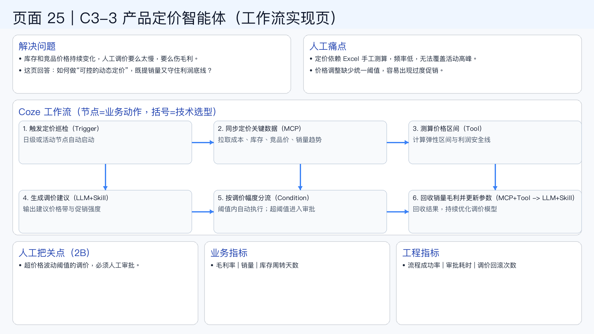

# 页面 25｜C3-3 产品定价智能体（工作流实现页）

## 这页解决什么问题
- `库存和竞品价格持续变化，人工调价要么太慢，要么伤毛利。`
- `这页回答：如何做“可控的动态定价”，既提销量又守住利润底线？`

## 人工方式为什么吃力
- `定价依赖 Excel 手工测算，频率低，无法覆盖活动高峰。`
- `价格调整缺少统一阈值，容易出现过度促销。`

## Coze 工作流（节点名=业务动作，括号=技术选型）
1. `触发定价巡检（Trigger）`
  - 日级或活动节点自动启动
2. `同步定价关键数据（MCP）`
  - 拉取成本、库存、竞品价、销量趋势
3. `测算价格区间（Tool）`
  - 计算弹性区间与利润安全线
4. `生成调价建议（LLM+Skill）`
  - 输出建议价格带与促销强度
5. `按调价幅度分流（Condition）`
  - 阈值内自动执行；超阈值进入审批
6. `回收销量毛利并更新参数（MCP+Tool -> LLM+Skill）`
  - 回收结果，持续优化调价模型

## 人工把关点（2B）
- 超价格波动阈值的调价，必须人工审批。

## 看结果的业务指标
- 毛利率 | 销量 | 库存周转天数

## 看系统稳定性的工程指标
- 流程成功率 | 审批耗时 | 调价回滚次数

## 页面展示

