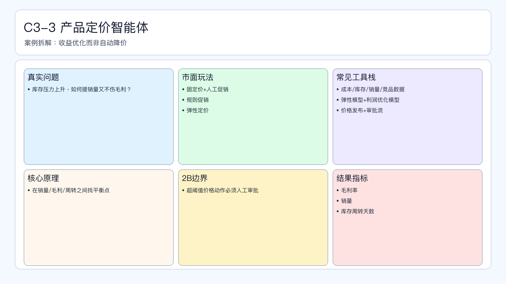

# 页面 25｜C3-3 产品定价智能体（业务决策页｜样板）

## 页面目标
回答“如何在销量与毛利之间做动态平衡”：不是自动降价，而是收益优化。

## 本页解决问题
- `库存压力上升时，如何提销量又不伤毛利？`

## 为什么人工难做
- 成本、库存、竞品价格、需求弹性变化快，人工反应慢。
- 定价改动影响范围大，试错成本高。
- 人工容易陷入“短期冲销量”，忽略长期毛利结构。

## 这个问题是否适合智能体
- 适合：规则清晰、阈值明确、可模拟验证。
- 不适合全自动：超价格阈值、品牌敏感SKU。

## 智能体产出
- 推荐价格带。
- 促销强度建议。
- 毛利-销量平衡解释。

## 2B 边界
- 超价格波动阈值必须人工审批。
- 核心SKU价格变更需双人复核。

## 页面展示

