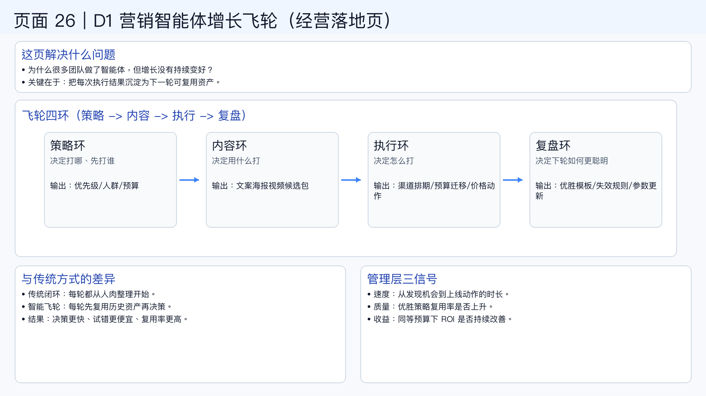

# 页面 26｜D1 营销智能体增长飞轮（经营落地页）

## 这页解决什么问题
- `为什么很多团队“做了智能体”但增长没有持续变好？`
- `核心不是一次提效，而是把每次执行结果变成下一轮可复用资产。`

## 飞轮四环（业务语言）
1. `策略环：决定打哪、先打谁`
  - 输出：优先级、人群、预算、目标阈值
2. `内容环：决定用什么打`
  - 输出：文案/海报/视频候选包与实验计划
3. `执行环：决定怎么打`
  - 输出：渠道排期、预算迁移、价格动作
4. `复盘环：决定下轮如何更聪明`
  - 输出：优胜模板、失效规则、参数更新

## 与传统方式的关键差异
- `传统闭环：每轮都从“人肉整理”开始。`
- `智能体飞轮：每轮都先吃历史资产，再做新决策。`
- `结果：决策更快、试错更便宜、复用率更高。`

## 管理层要盯的三个信号
- `速度`：从发现机会到上线动作的时长是否持续缩短。
- `质量`：优胜策略复用率是否持续上升。
- `收益`：同等预算下 ROI 是否持续改善。

## 一句话结论
- `智能体价值不在“替人做一次”，而在“让组织每一轮都更会做”。`

## 可视化建议（用于制图）
- 中部 `70%`：四环飞轮（策略 -> 内容 -> 执行 -> 复盘 -> 回到策略）
- 顶部 `15%`：问题定义与结论
- 底部 `15%`：管理层三信号（速度/质量/收益）

## 页面展示

